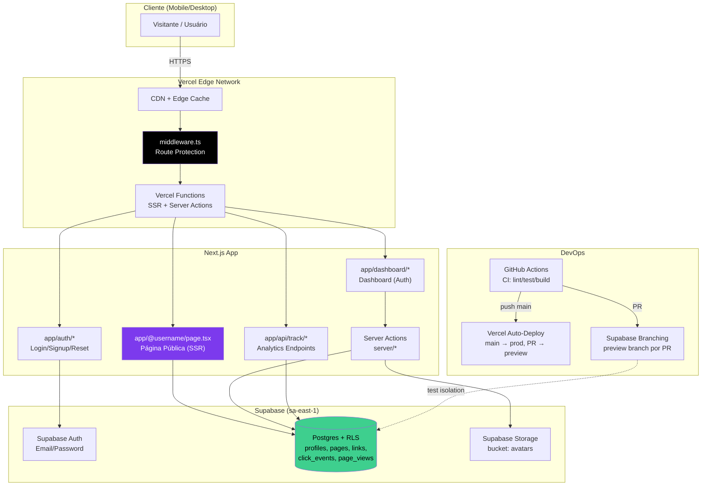
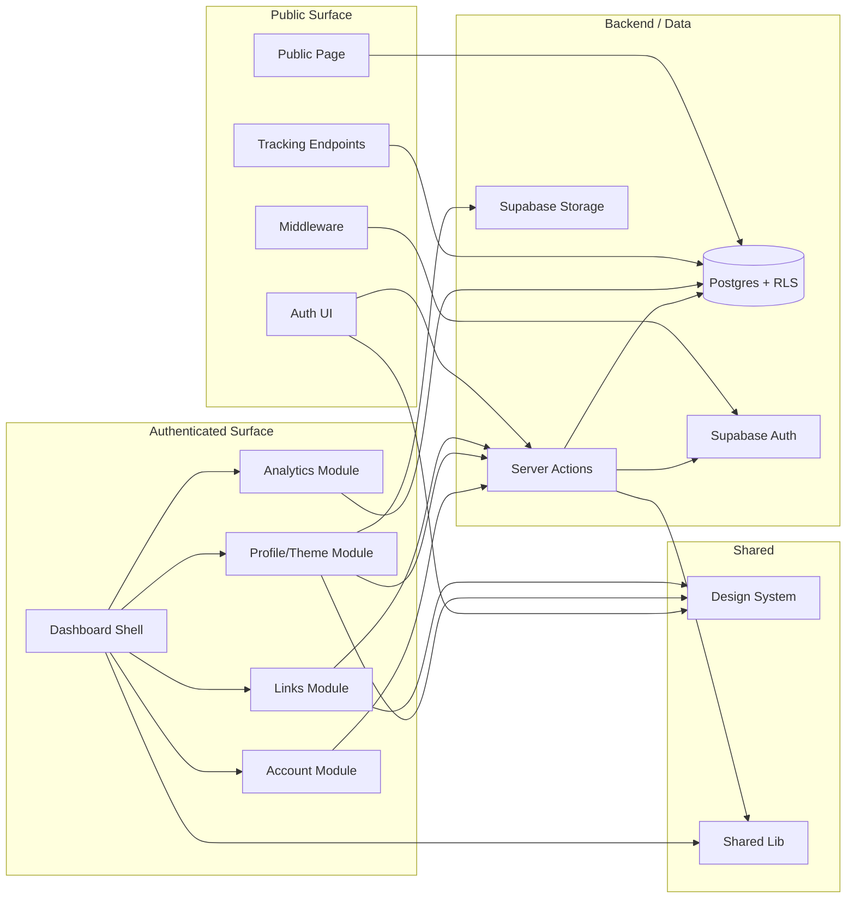
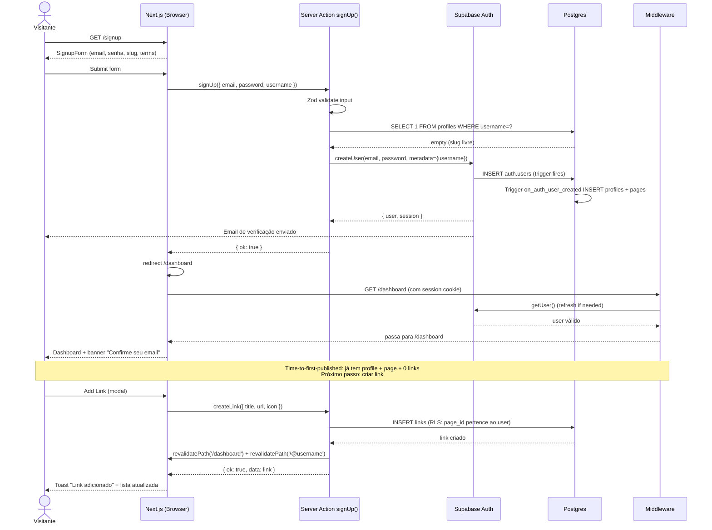
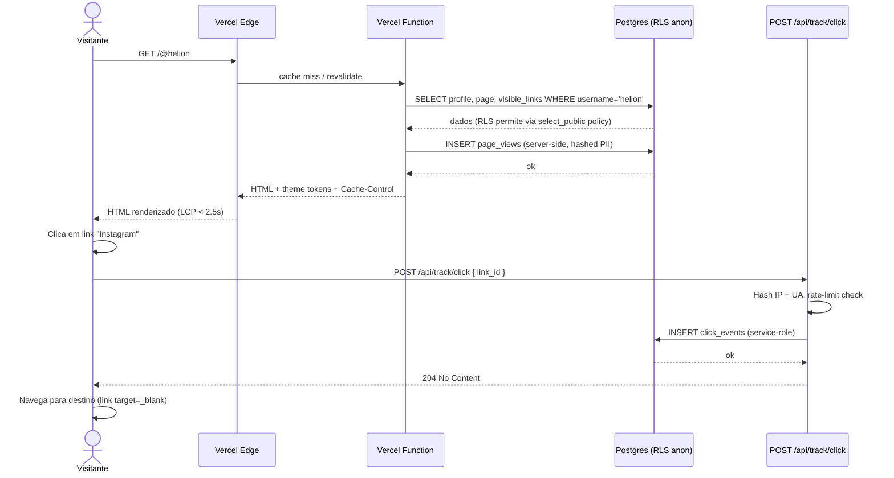
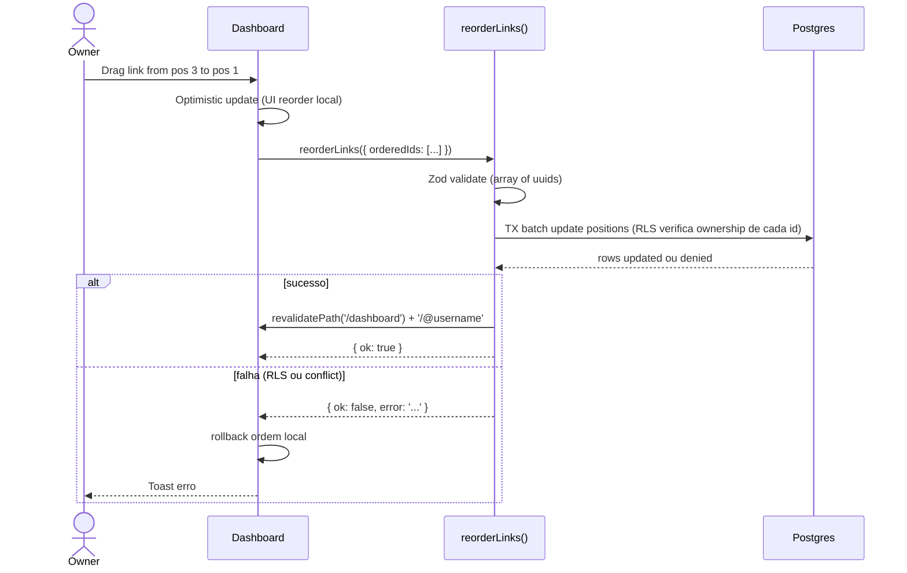
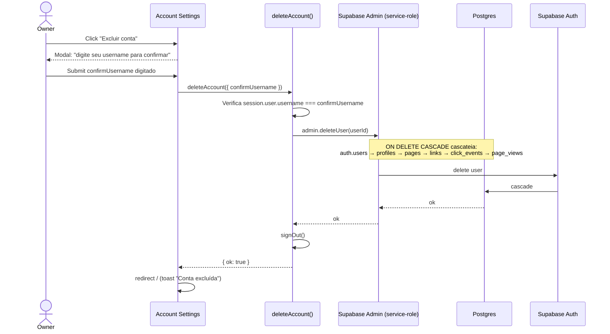
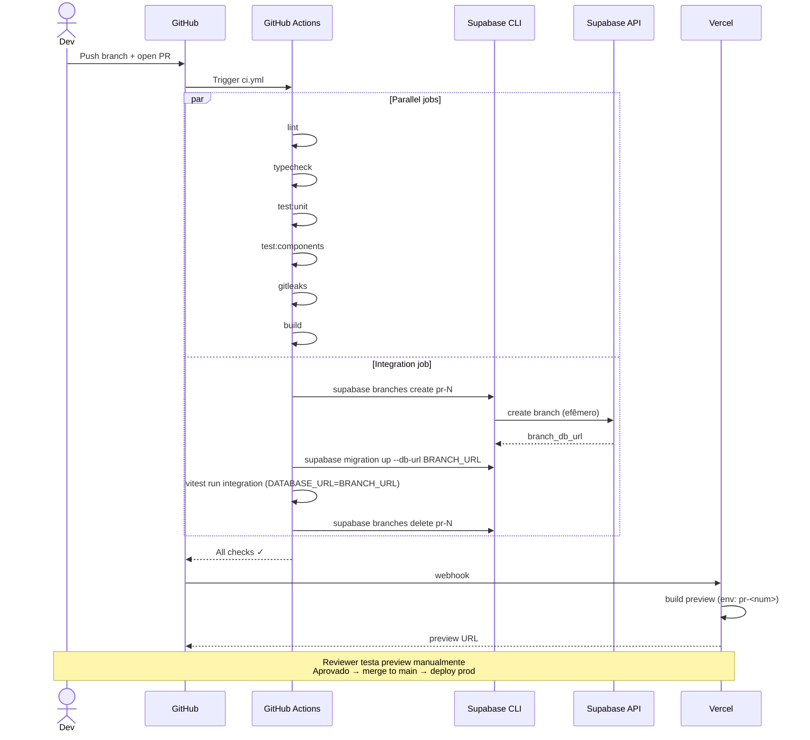
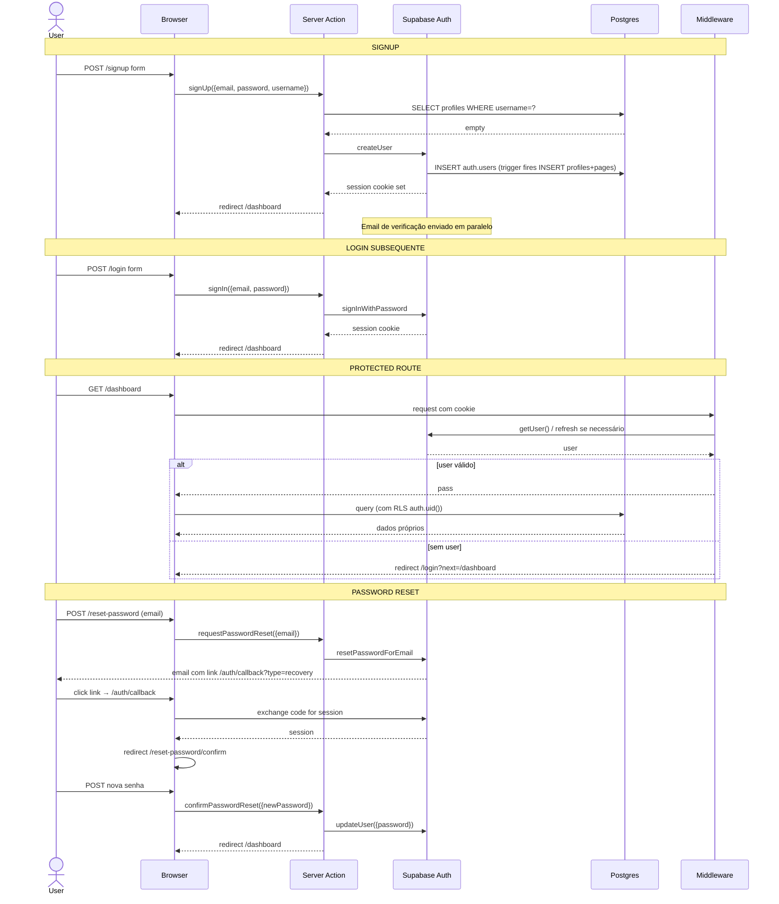
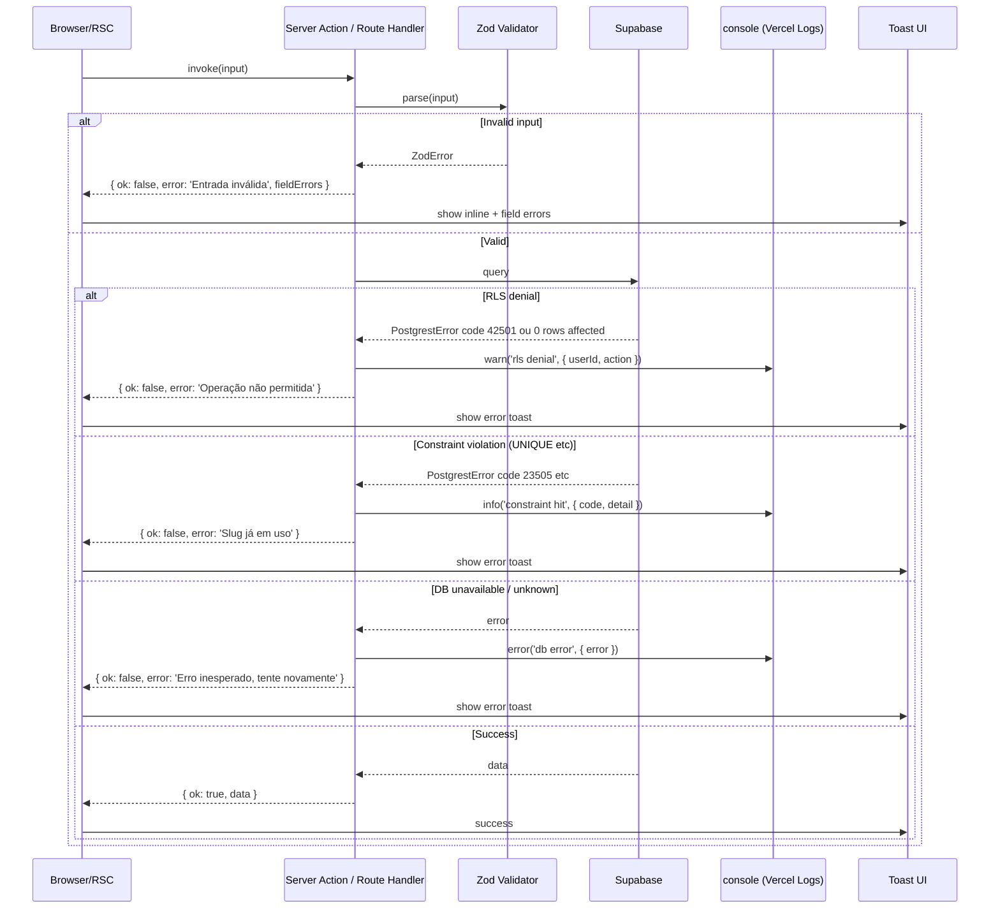

# BioLink Fullstack Architecture Document

> **Status:** Draft v0.1 — gerado em modo YOLO a partir de `docs/brief.md` (v1) e `docs/prd.md` (v0.3).
> **Owner:** @architect (Aria)
> **Source of truth (No-Invention — Constitution Art. IV):** `docs/brief.md` + `docs/prd.md`. Toda decisão aqui rastreia a um FR/NFR explícito ou a uma constraint formal do stakeholder.

---

## Introduction

Este documento descreve a arquitetura fullstack completa do **BioLink**, incluindo sistemas de backend, implementação de frontend e sua integração. Serve como **single source of truth** para desenvolvimento AI-driven, garantindo consistência em toda a stack tecnológica.

A abordagem unificada combina o que tradicionalmente seriam documentos separados (frontend / backend), alinhando-se ao caráter intrinsecamente full-stack de uma aplicação Next.js 16 + Supabase — Server Components, Server Actions e RLS borram (deliberadamente) a fronteira entre as camadas.

### Starter Template or Existing Project

**Decisão:** N/A — Greenfield, **sem starter template fullstack**. Bootstrap manual conforme stories 1.1–1.8 do PRD. Justificativa: caráter didático do projeto (brief §Solução) — cada decisão de configuração é uma oportunidade de aprendizado registrada.

**shadcn/ui** é adotado como biblioteca de componentes **copy-paste** (não-runtime), instalado componente a componente em `components/ui/`. Não constitui "starter" no sentido tradicional.

### Change Log

| Date | Version | Description | Author |
|------|---------|-------------|--------|
| 2026-05-07 | 0.1 | Draft inicial completo (modo YOLO) a partir de `docs/brief.md` v1 e `docs/prd.md` v0.3 | @architect (Aria) |
| 2026-05-07 | 0.2 | Incorpora findings do `*execute-checklist architect-checklist` (Risk 1-3): adiciona §Resilience, Degraded Mode & Recovery; documenta backup strategy do Supabase free tier; helper `revalidateUserSurface`; ESLint `no-restricted-imports` concreto; Dependabot na pipeline; encryption-at-rest explícito | @architect (Aria) |
| 2026-05-07 | 0.3 | **Tech Stack §CSS Framework:** Tailwind 3.x → **Tailwind 4.x** (default Next 16; CSS-first config via `@theme` em `app/globals.css` em vez de `tailwind.config.ts`). Atualizado quality gate findings da Story 1.1: Project Structure (§High Level + §Source Tree) também removem referência a `tailwind.config.ts` e adicionam `postcss.config.mjs`. Razão: `create-next-app@latest` para Next 16 instala Tailwind 4 default; CSS-first alinha melhor com PRD §Premissas Técnicas ("design tokens via CSS variables"). | @architect (Aria) |

---

## High Level Architecture

### Technical Summary

**BioLink** é uma aplicação **fullstack monolítica serverless**: Next.js 16 (App Router) renderizando frontend e backend em um único projeto deployado na Vercel, com Supabase como Backend-as-a-Service único (Postgres + Auth + Storage). A integração entre camadas usa **Server Components** (fetch de dados na renderização) e **Server Actions** (mutations) — sem API REST/GraphQL/tRPC explícita, exceto por dois Route Handlers para tracking de analytics (`/api/track/click`, `/api/track/view`).

A camada de dados é protegida por **Row-Level Security (RLS)** em todas as tabelas user-data, com policies testadas automaticamente em CI via **Supabase Branching** (preview branches efêmeros por PR — sem stack Supabase local). O frontend é **mobile-first** com Tailwind CSS + design tokens via CSS variables, suportando 3 temas presets. CI/CD via GitHub Actions impõe quality gates (lint, typecheck, unit, integration, components, build, gitleaks) antes de merge; Vercel faz auto-deploy em `main` com previews automáticos em PRs.

Esta arquitetura entrega os objetivos do PRD: **Lighthouse ≥ 90**, **LCP < 2.5s**, **deploy frequency ≥ 1/semana**, **0 incidentes de segurança via RLS**, e **100% das stories conformes ao SDC**.

### Platform and Infrastructure Choice

**Platform:** **Vercel + Supabase** (free tier durante MVP)
**Key Services:**
- **Vercel:** Hosting do Next.js, Edge Network/CDN, Vercel Functions (SSR + Server Actions), Preview Deployments por PR, Vercel Analytics (built-in, free tier — Web Vitals).
- **Supabase:** Postgres 15+ (managed), Supabase Auth (email/password), Supabase Storage (bucket `avatars`), Supabase Branching (CI integration tests), Supabase Dashboard (logs, advisors, monitoring).

**Deployment Host and Regions:**
- **Vercel:** auto (Edge — multi-region; Functions IAD1 default, ajustável para `gru1` São Paulo se latência LATAM justificar pós-MVP).
- **Supabase:** **`sa-east-1` (São Paulo)** — região mais próxima do público-alvo lusófono (brief §Target Users). Reduz latência DB→Function quando ambos estiverem em SP no Phase 2.

**Trade-off considerado e rejeitado:**
| Alternativa | Motivo da rejeição |
|---|---|
| AWS Full Stack (Lambda + RDS + Cognito) | Over-engineered para MVP; viola constraint "free tier"; latência de aprendizado grande. |
| Cloudflare Workers + D1/Neon | Edge-first é interessante, mas Supabase oferece auth + storage out-of-box, alinhando com objetivos didáticos do brief. |
| Self-hosted (Hetzner + Docker) | Inviabiliza objetivo "open-source desde dia 1 com onboarding < 5 min". |

### Repository Structure

**Structure:** **Single-package repository** (não monorepo, não workspace).
**Monorepo Tool:** N/A — projeto Next.js único conforme PRD §Estrutura do Repositório.
**Package Organization:** módulos por domínio dentro de `app/`, `components/`, `server/`, `lib/`, `supabase/`. **Justificativa:** escopo MVP não justifica multi-package (PRD: "Não há justificativa para multi-package no escopo MVP").

```
biolink/
├── app/                  # Next.js App Router (rotas + layouts)
├── components/           # Design system (ui/) + features
├── lib/                  # Helpers (supabase clients, validators, env, theme)
├── server/               # Server Actions agrupadas por domínio
├── supabase/             # migrations + seed.sql + RLS tests
├── tests/                # unit + integration + components
├── public/               # static assets (logo, og-image placeholder)
├── docs/                 # PRD, architecture, stories, guides
├── .github/workflows/    # CI/CD (ci.yml, deploy.yml, lighthouse.yml)
├── middleware.ts         # Next.js middleware (route protection)
└── (config files)        # tsconfig, next.config, postcss.config (Tailwind 4: sem tailwind.config), etc.
```

### High Level Architecture Diagram



### Architectural Patterns

- **Serverless Fullstack Monolith:** Next.js + Supabase em uma única deployment unit, sem services adicionais. _Rationale:_ escopo MVP (~5 tabelas, 4 epics) não justifica fragmentação; reduz complexidade ops e custo (free tier).
- **Server-First Rendering (RSC):** páginas públicas e dashboard renderizadas via Server Components com fetch direto ao Supabase. _Rationale:_ atende NFR3 (LCP < 2.5s), NFR4 (bundle JS < 200 KB), e PRD §Premissas Técnicas (SSR é objetivo didático explícito).
- **Server Actions como API Layer:** todas as mutations (CRUD links, profile, theme) via Server Actions tipadas com Zod. _Rationale:_ evita boilerplate de API REST, type-safety end-to-end, e exercita capability-alvo da stack.
- **RLS-First Authorization:** segurança no banco, não na aplicação. Policies em todas as tabelas user-data; aplicação **confia** que o cliente Supabase autenticado só vê o que tem permissão. _Rationale:_ NFR1 e NFR7 do PRD; reduz superficie de bugs de auth na aplicação.
- **Optimistic UI Updates:** drag-drop, toggle visibility, edit inline atualizam UI antes da confirmação do servidor; rollback com toast em erro. _Rationale:_ PRD §Paradigmas-Chave de Interação; melhora percepção de velocidade.
- **Component-Based UI com Owned Components:** shadcn/ui copia componentes para `components/ui/`, sem dependência runtime. _Rationale:_ controle total de estilo e a11y, sem lock-in.
- **Token-Based Theming:** CSS variables sob `[data-theme="..."]` para 3 temas. _Rationale:_ FR12; permite SSR sem flash de tema.
- **Schema-First Validation com Zod:** schemas Zod definem inputs de Server Actions, env vars, e gerar types compartilhados. _Rationale:_ single source of truth para validação client+server; integra com react-hook-form.
- **Branched Database Testing:** integration tests em CI rodam contra Supabase Branch efêmero por PR. _Rationale:_ NFR7 do PRD; sem necessidade de stack Supabase local (decisão 2026-05-07).
- **Hashed PII for Privacy:** ip_hash + user_agent_hash em analytics events. _Rationale:_ FR9, FR10, brief §LGPD-mindful; reduz risco LGPD sem perder utilidade analítica.

---

## Tech Stack

> **DEFINITIVO.** Esta tabela é a única source of truth para versões e tecnologias. Todas as stories devem usar exatamente estas escolhas.

### Technology Stack Table

| Category | Technology | Version | Purpose | Rationale |
|---|---|---|---|---|
| **Frontend Language** | TypeScript | 5.x (strict) | Type safety end-to-end | PRD §Premissas Técnicas: `strict: true` + `noUncheckedIndexedAccess: true`. |
| **Frontend Framework** | Next.js | 16.x (latest stable) | App Router, RSC, SSR, Server Actions | PRD §Arquitetura de Serviço (decisão crítica). |
| **UI Component Library** | shadcn/ui (Radix UI primitives) | latest | Componentes copy-paste, owned | PRD §Premissas Técnicas; sem dependência runtime. |
| **Icon Library** | lucide-react | latest | Ícones consistentes (link icons, UI) | Compat shadcn/ui; tree-shakeable; alinhado a FR6. |
| **State Management** | React Server Components + URL state + `useState` local | nativo | Sem store global | MVP não justifica Zustand/Redux; RSC + Server Actions cobrem 95%. |
| **Drag-and-Drop** | @dnd-kit/core + @dnd-kit/sortable | latest | Reorder de links (FR7) | Touch-friendly, a11y nativa, ativamente mantido. |
| **Forms** | react-hook-form + @hookform/resolvers/zod | latest | Forms tipados + validação | PRD §Premissas Técnicas. |
| **Validation** | Zod | latest | Schemas compartilhados (form + Server Actions + env) | PRD §Premissas Técnicas. |
| **CSS Framework** | Tailwind CSS | 4.x | Utility-first + design tokens via CSS vars (CSS-first config via `@theme` em `app/globals.css` — sem `tailwind.config.ts`) | PRD §Premissas Técnicas; default do Next.js 16 (validado em Story 1.1). |
| **Charts (Analytics)** | recharts | latest | Gráficos de série temporal (Story 4.4) | PRD §Story 4.4 menciona "recharts ou similar lightweight"; recharts é o escolhido. |
| **Backend Language** | TypeScript | 5.x | Mesmo runtime do frontend | Server Actions e Route Handlers em TS. |
| **Backend Framework** | Next.js Server Actions + Route Handlers | 16.x | API layer | PRD §Arquitetura de Serviço. |
| **API Style** | Server Actions (RPC-style) + 2 Route Handlers (POST /api/track/*) | nativo | Type-safe RPC para CRUD; HTTP para analytics | Server Actions cobrem 95%; Route Handlers necessários para tracking público sem auth. |
| **Database** | Postgres (via Supabase) | 15+ | Persistência relacional + RLS | PRD §Premissas Técnicas. |
| **Database Client** | @supabase/supabase-js + @supabase/ssr | latest | Clients server/browser | PRD §Premissas Técnicas. |
| **Cache** | Next.js `unstable_cache` + `revalidatePath`/`revalidateTag` | nativo | Cache de páginas públicas com revalidação | Atende NFR2-4 sem infra extra. |
| **File Storage** | Supabase Storage (bucket `avatars`) | nativo | Upload de avatar (FR13) | RLS policy no bucket; max 1 MB jpg/png/webp. |
| **Authentication** | Supabase Auth (email + password) | nativo | Identidade dos usuários | PRD FR1, FR2; sem OAuth no MVP. |
| **Frontend Testing** | Vitest + @testing-library/react + @testing-library/jest-dom | latest | Component tests | PRD §Requisitos de Testes; cobertura ≥ 50%. |
| **Backend Testing** | Vitest + Supabase JS SDK contra Supabase Branch | latest | Unit + Integration (Server Actions, RLS) | PRD §Requisitos de Testes; cobertura ≥ 70%. |
| **E2E Testing** | **N/A** | — | Sem E2E no MVP | PRD decisão crítica 2026-05-07; validação manual + integration tests cobrem fluxos. |
| **Build Tool** | Next.js (Turbopack) | nativo | Build + dev server | Default do Next.js 16. |
| **Bundler** | Turbopack (dev) / Webpack (build) | nativo | Bundling | Default Next.js 16. |
| **IaC Tool** | **N/A** (MVP) | — | Sem IaC explícito | Vercel + Supabase configurados via dashboard + Supabase CLI; revisitar em Phase 2 (Terraform/Pulumi). |
| **CI/CD** | GitHub Actions + Vercel | nativo | Pipeline + auto-deploy | PRD §Premissas Técnicas; NFR8. |
| **Monitoring** | Vercel Analytics (Web Vitals) + Supabase Dashboard + Vercel Logs | free tier | Observabilidade mínima | Free; sem Sentry/Datadog no MVP (constraint budget). |
| **Logging** | `console.*` capturado por Vercel Logs + Supabase Logs | nativo | Logs operacionais | Suficiente para 5+ usuários; revisitar pós-MVP. |
| **Secret Scanning** | gitleaks (pre-commit + CI) | latest | NFR10 (0 secrets versionados) | Hook Husky + GitHub Action. |
| **Linting** | ESLint (next/core-web-vitals) + Prettier + eslint-plugin-import | latest | Code quality | PRD §Premissas Técnicas. |
| **Pre-commit** | Husky + lint-staged | latest | Gates locais (typecheck, lint, gitleaks) | PRD §Premissas Técnicas. |
| **Package Manager** | pnpm | 9.x+ | Velocidade + workspaces-ready | Default moderno; Vercel suporta. |
| **Node Runtime** | Node.js | 20.x LTS | Runtime Vercel Functions | LTS atual; compat Next.js 16. |

---

## Data Models

> Modelos conceituais derivados dos FRs do PRD. DDL completo é responsabilidade de **@data-engineer (Dara)** em handoff posterior. Tipos TypeScript serão **gerados** via `supabase gen types typescript` (Story 1.2 AC5), não escritos à mão.

### Profile

**Purpose:** Identidade pública de cada usuário (FR4, FR13). 1:1 com `auth.users` (Supabase Auth).

**Key Attributes:**
- `id`: uuid (PK, ref `auth.users.id`, on delete cascade)
- `username`: citext UNIQUE (3-30 chars, regex `^[a-z0-9-]+$`, não-reservado) — FR4
- `display_name`: text (≤ 50 chars) — FR13
- `bio`: text (≤ 280 chars) — FR13
- `avatar_url`: text (URL Supabase Storage) — FR13
- `created_at`: timestamptz default `now()`
- `updated_at`: timestamptz default `now()`

#### TypeScript Interface (gerado por supabase-cli)

```typescript
// Forma esperada — referência apenas; Database type vem de supabase gen types.
export type Profile = {
  id: string;
  username: string;
  display_name: string | null;
  bio: string | null;
  avatar_url: string | null;
  created_at: string;
  updated_at: string;
};
```

#### Relationships

- 1:1 → `auth.users` (Supabase Auth, FK em `id`)
- 1:1 → `Page` (no MVP; preparado para 1:N em Phase 2 conforme PRD Story 2.2)

---

### Page

**Purpose:** Container de configuração da página pública (FR5, FR12). 1:1 com Profile no MVP.

**Key Attributes:**
- `id`: uuid (PK)
- `profile_id`: uuid (FK → profiles.id, UNIQUE, on delete cascade)
- `theme`: enum `'light' | 'dark' | 'brand'` default `'light'` — FR12
- `is_published`: boolean default `true`
- `created_at`, `updated_at`: timestamptz

#### TypeScript Interface

```typescript
export type Page = {
  id: string;
  profile_id: string;
  theme: 'light' | 'dark' | 'brand';
  is_published: boolean;
  created_at: string;
  updated_at: string;
};
```

#### Relationships

- N:1 → `Profile` (UNIQUE no MVP, força 1:1)
- 1:N → `Link`
- 1:N → `PageView`

---

### Link

**Purpose:** Item clicável na página pública (FR6, FR7, FR8).

**Key Attributes:**
- `id`: uuid (PK)
- `page_id`: uuid (FK → pages.id, on delete cascade)
- `title`: text NOT NULL (≤ 100 chars) — FR6
- `url`: text NOT NULL (validação HTTP/HTTPS) — FR6
- `icon`: text (slug de lucide-react, ex: `'instagram'`, `'twitter'`, `'globe'`) — FR6
- `is_visible`: boolean default `true` — FR8
- `position`: integer (UNIQUE per page_id) — FR7
- `created_at`, `updated_at`: timestamptz

#### TypeScript Interface

```typescript
export type Link = {
  id: string;
  page_id: string;
  title: string;
  url: string;
  icon: string | null;
  is_visible: boolean;
  position: number;
  created_at: string;
  updated_at: string;
};
```

#### Relationships

- N:1 → `Page`
- 1:N → `ClickEvent`

---

### ClickEvent

**Purpose:** Registro bruto de cliques em links (FR9). Hashed PII para LGPD-mindfulness.

**Key Attributes:**
- `id`: bigint (PK, identity) — escolhido sobre uuid pois volume pode ser alto e bigint é mais compacto/rápido para tabelas append-only
- `link_id`: uuid (FK → links.id, on delete cascade)
- `clicked_at`: timestamptz default `now()`
- `user_agent_hash`: bytea (sha-256, salt em env)
- `ip_hash`: bytea (sha-256, salt em env)

#### TypeScript Interface

```typescript
export type ClickEvent = {
  id: number;
  link_id: string;
  clicked_at: string;
  user_agent_hash: string; // hex/base64
  ip_hash: string;
};
```

#### Relationships

- N:1 → `Link`

---

### PageView

**Purpose:** Registro bruto de visualizações de página (FR10). Mesma estratégia de privacidade.

**Key Attributes:**
- `id`: bigint (PK, identity)
- `page_id`: uuid (FK → pages.id, on delete cascade)
- `viewed_at`: timestamptz default `now()`
- `user_agent_hash`: bytea
- `ip_hash`: bytea

#### Relationships

- N:1 → `Page`

---

### Aggregation Views (Story 4.3)

Views regulares (não-materialized no MVP):
- `link_clicks_7d(link_id, day, count)`
- `link_clicks_30d(link_id, day, count)`
- `page_views_7d(page_id, day, count)`
- `page_views_30d(page_id, day, count)`

**Trade-off documentado:** views regulares no MVP (refresh sob demanda, query mais cara mas sempre fresh); migrar para materialized views se P95 do dashboard analytics exceder 500ms.

---

## API Specification

### API Style: Server Actions + Route Handlers

**Decisão:** Sem REST/GraphQL/tRPC formal. A "API" é composta por:

1. **Server Actions** (RPC-style, type-safe): mutations do dashboard (CRUD links, profile, theme, account).
2. **Route Handlers** (HTTP POST): apenas para tracking público de analytics, onde o cliente público (sem sessão) precisa enviar eventos.

**Rationale:** Server Actions são a feature canônica do Next.js 16 que o PRD §Premissas Técnicas declara exercitar. Type-safety end-to-end via TypeScript, sem boilerplate de API. Route Handlers entram só onde Server Actions não cabem (chamada de fetch desde JS no cliente público anônimo).

### Server Actions (Inventário Canônico)

> Cada Server Action recebe inputs validados por Zod, executa via Supabase client autenticado (RLS aplicada), e retorna `{ ok: true, data } | { ok: false, error }`. Erros são strings i18n-keys ou mensagens PT-BR.

```typescript
// server/profile/actions.ts
export async function updateProfile(input: UpdateProfileInput): Promise<ActionResult<Profile>>;
export async function updateUsername(input: { username: string }): Promise<ActionResult<Profile>>;
export async function uploadAvatar(formData: FormData): Promise<ActionResult<{ avatar_url: string }>>;

// server/links/actions.ts
export async function createLink(input: CreateLinkInput): Promise<ActionResult<Link>>;
export async function updateLink(input: UpdateLinkInput): Promise<ActionResult<Link>>;
export async function deleteLink(input: { id: string }): Promise<ActionResult<void>>;
export async function toggleLinkVisibility(input: { id: string; is_visible: boolean }): Promise<ActionResult<Link>>;
export async function reorderLinks(input: { orderedIds: string[] }): Promise<ActionResult<void>>;

// server/page/actions.ts
export async function updateTheme(input: { theme: 'light' | 'dark' | 'brand' }): Promise<ActionResult<Page>>;
export async function togglePublished(input: { is_published: boolean }): Promise<ActionResult<Page>>;

// server/account/actions.ts
export async function exportAccountData(): Promise<ActionResult<AccountExport>>;
export async function deleteAccount(input: { confirmUsername: string }): Promise<ActionResult<void>>;

// server/auth/actions.ts (wrappers sobre supabase.auth)
export async function signUp(input: SignUpInput): Promise<ActionResult<void>>;
export async function signIn(input: SignInInput): Promise<ActionResult<void>>;
export async function signOut(): Promise<ActionResult<void>>;
export async function requestPasswordReset(input: { email: string }): Promise<ActionResult<void>>;
export async function confirmPasswordReset(input: { newPassword: string }): Promise<ActionResult<void>>;
```

### Route Handlers

```typescript
// app/api/track/click/route.ts
// Body: { link_id: string }
// Resolve link via service-role client; rejeita 404 se inexistente ou page.is_published=false.
// Hashifica user-agent e ip; insert em click_events.
// Rate limit: 60 req/min por ip_hash (upstash-redis-free OU memory fallback).
POST /api/track/click

// app/api/track/view/route.ts
// Body: { page_id: string }
// Deduplicação: 1 view por (ip_hash, page_id) em janela de 30 min.
// Mesma estratégia de hash.
POST /api/track/view
```

> **Nota:** tracking de page view é preferencialmente feito **server-side** dentro do Server Component da página pública (Story 4.2 AC2 — "preferível, evita JS extra"). O Route Handler `/api/track/view` existe como fallback para cenários onde o RSC não pode inserir (ex: página em ISR já renderizada).

### Common Result Type

```typescript
// lib/result.ts
export type ActionResult<T> =
  | { ok: true; data: T }
  | { ok: false; error: string; fieldErrors?: Record<string, string> };
```

---

## Components

### Component Inventory

#### 1. **Edge / Middleware Layer**

**Responsibility:** Validar sessão Supabase em rotas privadas; redirecionar guests; permitir rotas públicas (`/@username`, `/`, `/login`, `/signup`, `/reset-password`, `/api/track/*`).

**Key Interfaces:**
- `middleware.ts` matcher pattern excluindo assets e rotas públicas.
- `@supabase/ssr` createServerClient para refresh de sessão automático.

**Dependencies:** Supabase Auth.

**Technology Stack:** Next.js 16 middleware + @supabase/ssr.

#### 2. **Public Page Renderer**

**Responsibility:** Render SSR de `/@<username>` — fetch de profile + page + links visíveis em uma única query, render layout vertical mobile-first, registro server-side de page view (Story 4.2).

**Key Interfaces:**
- `app/@[username]/page.tsx` (Server Component)
- `lib/supabase/server.ts` (anon client com RLS)
- `lib/track.ts` (insertPageView server-side)

**Dependencies:** Supabase DB, lucide-react (ícones).

**Technology Stack:** RSC + Tailwind + Theme tokens.

#### 3. **Auth UI Layer**

**Responsibility:** Páginas `/signup`, `/login`, `/reset-password`, `/auth/callback`. Forms validados client-side (react-hook-form + Zod), submetidos a Server Actions.

**Key Interfaces:**
- `app/(auth)/signup/page.tsx`, `app/(auth)/login/page.tsx`, `app/(auth)/reset-password/page.tsx`
- `components/auth/SignupForm.tsx`, etc.
- Server Actions de `server/auth/`

**Dependencies:** Supabase Auth, design system (Form, Input, Button, Toast).

#### 4. **Dashboard Shell**

**Responsibility:** Layout autenticado (`/dashboard/*`) — sidebar (desktop) / drawer (mobile), header com avatar dropdown, navegação entre tabs (Links, Profile, Theme, Analytics, Account).

**Key Interfaces:**
- `app/dashboard/layout.tsx`
- `components/dashboard/Sidebar.tsx`, `MobileDrawer.tsx`, `UserMenu.tsx`

**Dependencies:** Auth state (RSC), Supabase client.

#### 5. **Links Management Module**

**Responsibility:** CRUD de links (FR6) + reorder drag-drop (FR7) + toggle visibility (FR8).

**Key Interfaces:**
- `app/dashboard/page.tsx` (Server Component lista links)
- `components/links/LinkList.tsx`, `LinkRow.tsx`, `AddLinkModal.tsx`
- @dnd-kit/core + @dnd-kit/sortable
- Server Actions de `server/links/`

**Dependencies:** Supabase DB (RLS), Zod schemas.

#### 6. **Profile / Theme Module**

**Responsibility:** Edição de profile (FR13) e seleção de tema (FR12) com preview live.

**Key Interfaces:**
- `app/dashboard/profile/page.tsx`, `app/dashboard/theme/page.tsx`
- `components/profile/AvatarUpload.tsx`
- Server Actions de `server/profile/`, `server/page/`

**Dependencies:** Supabase Storage (avatars), CSS variables theme system.

#### 7. **Analytics Module**

**Responsibility:** Dashboard de métricas (FR11) — 4 cards de totais, gráfico de série temporal, tabela por link.

**Key Interfaces:**
- `app/dashboard/analytics/page.tsx` (Server Component fetch das views agregadas)
- `components/analytics/MetricsCards.tsx`, `TimeSeriesChart.tsx`, `LinksTable.tsx`
- recharts

**Dependencies:** Aggregation views (`link_clicks_7d`, etc.).

#### 8. **Tracking Endpoints**

**Responsibility:** Receber events de cliques (FR9), opcionalmente views (FR10) — rate-limit, hash de PII, insert.

**Key Interfaces:**
- `app/api/track/click/route.ts`
- `app/api/track/view/route.ts`
- `lib/hash.ts` (sha256 com salt)
- `lib/rate-limit.ts` (in-memory para MVP)

**Dependencies:** Supabase service-role client (bypass RLS para insert legítimo).

#### 9. **Account Module**

**Responsibility:** Export de dados (FR16) e exclusão de conta (FR15) com cascade.

**Key Interfaces:**
- `app/dashboard/account/page.tsx`
- Server Actions de `server/account/` (executam com service-role para exclusão segura)

#### 10. **Design System (`components/ui/`)**

**Responsibility:** Primitives reutilizáveis (FR14): Button, Input, Form, Toast, Card, Avatar, Modal.

**Key Interfaces:** APIs shadcn/ui, customizadas para tokens BioLink.

**Dependencies:** Radix UI primitives, Tailwind, lucide-react.

#### 11. **Shared Lib**

**Responsibility:** Utilitários cross-cutting.

**Key Interfaces:**
- `lib/supabase/server.ts`, `lib/supabase/client.ts`, `lib/supabase/admin.ts` (service-role)
- `lib/env.ts` (validação Zod de env vars)
- `lib/validators/*` (Zod schemas reutilizáveis)
- `lib/result.ts` (ActionResult)
- `lib/theme.ts` (tipo Theme + helpers)
- `lib/reserved-usernames.ts` (lista para FR4)
- `lib/hash.ts` (sha256+salt)

#### 12. **CI/CD Pipeline (cross-cutting)**

**Responsibility:** Quality gates antes de merge; auto-deploy em main.

**Key Interfaces:**
- `.github/workflows/ci.yml` (lint, typecheck, test:unit, test:integration, test:components, build, gitleaks)
- `.github/workflows/lighthouse.yml` (Lighthouse CI em rotas-chave)
- Vercel deploy hooks
- Supabase CLI para branching

### Component Diagram



---

## External APIs

**Decisão:** **Nenhuma integração externa obrigatória no MVP.** Conforme brief §Integration Requirements e PRD §Constraints:

- **Email transacional:** built-in Supabase Auth (verificação + reset). Limitação aceita: rate-limits do free tier; templates customizáveis em PT-BR via dashboard Supabase.
- **Analytics externo:** N/A — todas as métricas em Postgres próprio (FR9-11).
- **OAuth providers:** N/A — apenas email/password (PRD §FR1).
- **CDN:** Vercel Edge Network (built-in).

> **Phase 2** poderá considerar: Resend/Postmark para email transacional rico, Sentry para error tracking, Plausible para analytics web (complementar).

---

## Core Workflows

### Workflow 1: Signup → First Link Published



### Workflow 2: Public Page Visit + Click Tracking



### Workflow 3: Reorder Links (Optimistic Update)



### Workflow 4: Account Deletion (LGPD)



### Workflow 5: CI/CD with Supabase Branching



---

## Database Schema

> DDL canônico delegado a **@data-engineer (Dara)** via handoff. Esquema abaixo é referência arquitetural; implementação detalhada (índices secundários, triggers, função de hash, RLS policies SQL completas) virá de @data-engineer.

```sql
-- ============================================
-- 0001_init.sql (referência — refinar com @data-engineer)
-- ============================================

CREATE EXTENSION IF NOT EXISTS citext;
CREATE EXTENSION IF NOT EXISTS pgcrypto; -- para gen_random_uuid e digest()

-- ===== profiles =====
CREATE TABLE profiles (
  id           uuid PRIMARY KEY REFERENCES auth.users(id) ON DELETE CASCADE,
  username     citext NOT NULL UNIQUE
                 CHECK (username ~ '^[a-z0-9-]{3,30}$'),
  display_name text CHECK (length(display_name) <= 50),
  bio          text CHECK (length(bio) <= 280),
  avatar_url   text,
  created_at   timestamptz NOT NULL DEFAULT now(),
  updated_at   timestamptz NOT NULL DEFAULT now()
);

CREATE INDEX idx_profiles_username ON profiles (username);

-- ===== pages =====
CREATE TYPE theme_preset AS ENUM ('light', 'dark', 'brand');

CREATE TABLE pages (
  id           uuid PRIMARY KEY DEFAULT gen_random_uuid(),
  profile_id   uuid NOT NULL UNIQUE REFERENCES profiles(id) ON DELETE CASCADE,
  theme        theme_preset NOT NULL DEFAULT 'light',
  is_published boolean NOT NULL DEFAULT true,
  created_at   timestamptz NOT NULL DEFAULT now(),
  updated_at   timestamptz NOT NULL DEFAULT now()
);

-- ===== links =====
CREATE TABLE links (
  id          uuid PRIMARY KEY DEFAULT gen_random_uuid(),
  page_id     uuid NOT NULL REFERENCES pages(id) ON DELETE CASCADE,
  title       text NOT NULL CHECK (length(title) <= 100),
  url         text NOT NULL CHECK (url ~* '^https?://'),
  icon        text,
  is_visible  boolean NOT NULL DEFAULT true,
  position    integer NOT NULL,
  created_at  timestamptz NOT NULL DEFAULT now(),
  updated_at  timestamptz NOT NULL DEFAULT now(),
  CONSTRAINT uniq_position_per_page UNIQUE (page_id, position) DEFERRABLE INITIALLY DEFERRED
);

CREATE INDEX idx_links_page_id_position ON links (page_id, position);

-- ===== click_events =====
CREATE TABLE click_events (
  id              bigint GENERATED ALWAYS AS IDENTITY PRIMARY KEY,
  link_id         uuid NOT NULL REFERENCES links(id) ON DELETE CASCADE,
  clicked_at      timestamptz NOT NULL DEFAULT now(),
  user_agent_hash bytea,
  ip_hash         bytea
);

CREATE INDEX idx_click_events_link_id_clicked_at ON click_events (link_id, clicked_at DESC);

-- ===== page_views =====
CREATE TABLE page_views (
  id              bigint GENERATED ALWAYS AS IDENTITY PRIMARY KEY,
  page_id         uuid NOT NULL REFERENCES pages(id) ON DELETE CASCADE,
  viewed_at       timestamptz NOT NULL DEFAULT now(),
  user_agent_hash bytea,
  ip_hash         bytea
);

CREATE INDEX idx_page_views_page_id_viewed_at ON page_views (page_id, viewed_at DESC);

-- ===== Aggregation Views (Story 4.3) =====
CREATE VIEW link_clicks_7d AS
SELECT link_id, date_trunc('day', clicked_at) AS day, count(*) AS count
FROM click_events
WHERE clicked_at >= now() - interval '7 days'
GROUP BY link_id, date_trunc('day', clicked_at);

CREATE VIEW link_clicks_30d AS
SELECT link_id, date_trunc('day', clicked_at) AS day, count(*) AS count
FROM click_events
WHERE clicked_at >= now() - interval '30 days'
GROUP BY link_id, date_trunc('day', clicked_at);

CREATE VIEW page_views_7d AS
SELECT page_id, date_trunc('day', viewed_at) AS day, count(*) AS count
FROM page_views
WHERE viewed_at >= now() - interval '7 days'
GROUP BY page_id, date_trunc('day', viewed_at);

CREATE VIEW page_views_30d AS
SELECT page_id, date_trunc('day', viewed_at) AS day, count(*) AS count
FROM page_views
WHERE viewed_at >= now() - interval '30 days'
GROUP BY page_id, date_trunc('day', viewed_at);

-- ===== Trigger: criar profile + page automaticamente após signup =====
CREATE OR REPLACE FUNCTION on_auth_user_created() RETURNS trigger AS $$
DECLARE
  v_username citext := lower(NEW.raw_user_meta_data->>'username');
  v_profile_id uuid;
BEGIN
  INSERT INTO profiles (id, username) VALUES (NEW.id, v_username) RETURNING id INTO v_profile_id;
  INSERT INTO pages (profile_id) VALUES (v_profile_id);
  RETURN NEW;
END;
$$ LANGUAGE plpgsql SECURITY DEFINER;

CREATE TRIGGER auth_user_created
AFTER INSERT ON auth.users
FOR EACH ROW EXECUTE FUNCTION on_auth_user_created();

-- ===== RLS (template canônico — completar com @data-engineer) =====
ALTER TABLE profiles ENABLE ROW LEVEL SECURITY;
ALTER TABLE pages ENABLE ROW LEVEL SECURITY;
ALTER TABLE links ENABLE ROW LEVEL SECURITY;
ALTER TABLE click_events ENABLE ROW LEVEL SECURITY;
ALTER TABLE page_views ENABLE ROW LEVEL SECURITY;

-- profiles: select público (todos podem ler — username é público); update só do dono
CREATE POLICY "profiles_select_public" ON profiles FOR SELECT USING (true);
CREATE POLICY "profiles_update_own" ON profiles FOR UPDATE USING (auth.uid() = id);

-- pages: select público se published; update só do dono
CREATE POLICY "pages_select_public" ON pages FOR SELECT
  USING (is_published = true OR profile_id = auth.uid());
CREATE POLICY "pages_update_own" ON pages FOR UPDATE
  USING (profile_id = auth.uid());

-- links: select público se page published e link visible; mutate só do dono
CREATE POLICY "links_select_public" ON links FOR SELECT
  USING (
    EXISTS (
      SELECT 1 FROM pages p
      WHERE p.id = page_id
        AND (p.is_published = true OR p.profile_id = auth.uid())
    )
    AND (is_visible = true OR EXISTS (
      SELECT 1 FROM pages p WHERE p.id = page_id AND p.profile_id = auth.uid()
    ))
  );
CREATE POLICY "links_insert_own" ON links FOR INSERT WITH CHECK (
  EXISTS (SELECT 1 FROM pages p WHERE p.id = page_id AND p.profile_id = auth.uid())
);
CREATE POLICY "links_update_own" ON links FOR UPDATE USING (
  EXISTS (SELECT 1 FROM pages p WHERE p.id = page_id AND p.profile_id = auth.uid())
);
CREATE POLICY "links_delete_own" ON links FOR DELETE USING (
  EXISTS (SELECT 1 FROM pages p WHERE p.id = page_id AND p.profile_id = auth.uid())
);

-- click_events: insert via service-role only (bypass RLS); select_own
CREATE POLICY "click_events_select_own" ON click_events FOR SELECT USING (
  EXISTS (
    SELECT 1 FROM links l
    JOIN pages p ON p.id = l.page_id
    WHERE l.id = link_id AND p.profile_id = auth.uid()
  )
);
-- INSERT é feito com service-role no Route Handler — sem policy permissiva para anon

-- page_views: análogo a click_events
CREATE POLICY "page_views_select_own" ON page_views FOR SELECT USING (
  EXISTS (SELECT 1 FROM pages p WHERE p.id = page_id AND p.profile_id = auth.uid())
);
```

> **Notas para @data-engineer:**
> - Validar se `UNIQUE (page_id, position) DEFERRABLE INITIALLY DEFERRED` é a melhor estratégia para reorder atômico vs. trigger de "shift-on-delete".
> - Confirmar volume esperado de `click_events` justifica `bigint` ID (default vs. uuid).
> - Considerar partitioning por mês em `click_events`/`page_views` se NFR12 (retenção 90d) virar bottleneck.
> - Avaliar índice parcial em `links (page_id, position) WHERE is_visible = true` para acelerar página pública.

---

## Frontend Architecture

### Component Architecture

#### Component Organization

```
components/
├── ui/                          # shadcn/ui primitives (owned)
│   ├── button.tsx
│   ├── input.tsx
│   ├── form.tsx
│   ├── toast.tsx
│   ├── card.tsx
│   ├── avatar.tsx
│   ├── modal.tsx
│   └── (outros conforme necessidade)
├── auth/
│   ├── SignupForm.tsx
│   ├── LoginForm.tsx
│   └── ResetPasswordForm.tsx
├── dashboard/
│   ├── Sidebar.tsx
│   ├── MobileDrawer.tsx
│   ├── UserMenu.tsx
│   └── EmailVerificationBanner.tsx
├── links/
│   ├── LinkList.tsx             # SortableContext + DndContext wrapper
│   ├── LinkRow.tsx              # useSortable item
│   ├── AddLinkModal.tsx
│   ├── EditLinkInline.tsx
│   └── DeleteLinkDialog.tsx
├── profile/
│   ├── ProfileForm.tsx
│   ├── AvatarUpload.tsx
│   └── UsernameInput.tsx        # debounced uniqueness check
├── theme/
│   ├── ThemeSelector.tsx
│   └── ThemePreview.tsx
├── analytics/
│   ├── MetricsCards.tsx
│   ├── TimeSeriesChart.tsx      # recharts
│   └── LinksTable.tsx
├── account/
│   ├── ExportDataButton.tsx
│   └── DeleteAccountDialog.tsx
└── public/
    ├── PublicPage.tsx           # Server Component layout
    └── PublicLinkCard.tsx
```

#### Component Template (canônico)

```typescript
// components/links/LinkRow.tsx — exemplo canônico de Client Component interativo
'use client';

import { useSortable } from '@dnd-kit/sortable';
import { CSS } from '@dnd-kit/utilities';
import { Switch } from '@/components/ui/switch';
import { Button } from '@/components/ui/button';
import { GripVertical, Pencil, Trash2 } from 'lucide-react';
import { toggleLinkVisibility, deleteLink } from '@/server/links/actions';
import { useToast } from '@/components/ui/use-toast';
import type { Link } from '@/lib/supabase/types';

type Props = { link: Link };

export function LinkRow({ link }: Props) {
  const { attributes, listeners, setNodeRef, transform, transition } = useSortable({ id: link.id });
  const { toast } = useToast();

  const style = { transform: CSS.Transform.toString(transform), transition };

  async function handleToggle(next: boolean) {
    const res = await toggleLinkVisibility({ id: link.id, is_visible: next });
    if (!res.ok) toast({ title: 'Erro', description: res.error, variant: 'destructive' });
  }

  return (
    <div ref={setNodeRef} style={style} className="flex items-center gap-3 rounded-lg border p-3">
      <button {...attributes} {...listeners} aria-label="Reordenar" className="cursor-grab">
        <GripVertical className="h-4 w-4" />
      </button>
      <div className="flex-1 min-w-0">
        <p className="font-medium truncate">{link.title}</p>
        <p className="text-sm text-muted-foreground truncate">{link.url}</p>
      </div>
      <Switch checked={link.is_visible} onCheckedChange={handleToggle} aria-label="Visível" />
      {/* edit + delete buttons */}
    </div>
  );
}
```

### State Management Architecture

#### State Structure

**Filosofia:** Server Components + URL state cobrem o caso geral; `useState` local para UI volátil; **sem store global**.

```typescript
// Tipos de estado por categoria:

// 1. Server state (canonical) — fetched em RSC
//    - profile, pages, links, analytics → fetched no page.tsx
//    - revalidação via revalidatePath após mutations
//    - NUNCA armazenado em store global no cliente

// 2. URL state — filtros e tabs
//    Ex: /dashboard/analytics?range=30d → useSearchParams
type AnalyticsRange = '7d' | '30d';

// 3. Form state — react-hook-form (local ao form)
type LinkFormValues = { title: string; url: string; icon?: string };

// 4. UI state — useState/useReducer locais
//    - modal open/closed, drawer aberto, drag activo, optimistic list
//    - escopo: um único componente ou sua árvore imediata

// 5. Auth state — exposto via hook que consome supabase.auth
//    - useSession() hook custom retorna { user, isLoading } via @supabase/ssr
//    - prefer fetch em RSC sempre que possível
```

#### State Management Patterns

- **RSC-first:** dado vem do server; cliente não duplica.
- **Server Actions revalidam:** após mutation, `revalidatePath('/dashboard')` força refresh do RSC; UI reflete sem store global.
- **Optimistic updates locais:** drag-drop e toggle usam `useOptimistic` (Next 16) ou `useState` + rollback.
- **URL como source of truth para filtros:** range de analytics, tabs ativas — bookmarkable e shareable.
- **Auth via hook fino:** `useSession()` chama `supabase.auth.getUser()` ou observa `onAuthStateChange`. Sem context provider global.

### Routing Architecture

#### Route Organization (App Router)

```
app/
├── layout.tsx                     # Root layout (theme provider, fonts, metadata global)
├── page.tsx                       # / (landing pública SSR)
├── (auth)/                        # Route group, sem prefixo URL
│   ├── login/page.tsx
│   ├── signup/page.tsx
│   ├── reset-password/
│   │   ├── page.tsx
│   │   └── confirm/page.tsx
│   └── auth/callback/route.ts     # Route Handler para Supabase email confirm
├── dashboard/
│   ├── layout.tsx                 # Auth guard (RSC) + sidebar
│   ├── page.tsx                   # /dashboard (Links — default tab)
│   ├── profile/page.tsx
│   ├── theme/page.tsx
│   ├── analytics/page.tsx
│   └── account/page.tsx
├── @[username]/                   # /@helion (página pública)
│   └── page.tsx                   # SSR
├── api/
│   └── track/
│       ├── click/route.ts
│       └── view/route.ts
└── globals.css                    # Tokens CSS variables (themes)
```

#### Protected Route Pattern

```typescript
// middleware.ts — proteção centralizada
import { type NextRequest, NextResponse } from 'next/server';
import { createServerClient } from '@supabase/ssr';

const PROTECTED_PREFIXES = ['/dashboard'];
const AUTH_PAGES = ['/login', '/signup', '/reset-password'];

export async function middleware(req: NextRequest) {
  const res = NextResponse.next();

  // Páginas públicas não precisam de session check
  if (req.nextUrl.pathname.startsWith('/@')) return res;
  if (req.nextUrl.pathname.startsWith('/api/track')) return res;

  const supabase = createServerClient(
    process.env.NEXT_PUBLIC_SUPABASE_URL!,
    process.env.NEXT_PUBLIC_SUPABASE_ANON_KEY!,
    {
      cookies: {
        getAll: () => req.cookies.getAll(),
        setAll: (toSet) => toSet.forEach(({ name, value, options }) =>
          res.cookies.set(name, value, options)),
      },
    },
  );

  const { data: { user } } = await supabase.auth.getUser();
  const path = req.nextUrl.pathname;

  if (PROTECTED_PREFIXES.some(p => path.startsWith(p)) && !user) {
    const url = req.nextUrl.clone();
    url.pathname = '/login';
    url.searchParams.set('next', path);
    return NextResponse.redirect(url);
  }

  if (AUTH_PAGES.some(p => path.startsWith(p)) && user) {
    const url = req.nextUrl.clone();
    url.pathname = '/dashboard';
    return NextResponse.redirect(url);
  }

  return res;
}

export const config = {
  matcher: [
    '/((?!_next/static|_next/image|favicon.ico|.*\\.(?:svg|png|jpg|jpeg|gif|webp)$).*)',
  ],
};
```

### Frontend Services Layer

#### API Client Setup

```typescript
// lib/supabase/server.ts — para Server Components / Server Actions / Route Handlers
import { cookies } from 'next/headers';
import { createServerClient } from '@supabase/ssr';
import { env } from '@/lib/env';

export async function createClient() {
  const cookieStore = await cookies();
  return createServerClient(env.NEXT_PUBLIC_SUPABASE_URL, env.NEXT_PUBLIC_SUPABASE_ANON_KEY, {
    cookies: {
      getAll: () => cookieStore.getAll(),
      setAll: (toSet) => toSet.forEach(({ name, value, options }) =>
        cookieStore.set(name, value, options)),
    },
  });
}

// lib/supabase/client.ts — para Client Components (rare; prefer Server Actions)
import { createBrowserClient } from '@supabase/ssr';
import { env } from '@/lib/env';

export function createClient() {
  return createBrowserClient(env.NEXT_PUBLIC_SUPABASE_URL, env.NEXT_PUBLIC_SUPABASE_ANON_KEY);
}

// lib/supabase/admin.ts — service-role; APENAS em Server Actions/Route Handlers,
// NUNCA importar em Client Component. ESLint rule reforça isso.
import { createClient as createAdminClient } from '@supabase/supabase-js';
import { env } from '@/lib/env';

export function createAdmin() {
  if (typeof window !== 'undefined') {
    throw new Error('admin client cannot be used in the browser');
  }
  return createAdminClient(env.NEXT_PUBLIC_SUPABASE_URL, env.SUPABASE_SERVICE_ROLE_KEY, {
    auth: { autoRefreshToken: false, persistSession: false },
  });
}
```

#### Service Example

```typescript
// lib/cache.ts — helper canônico de revalidação (única forma autorizada)
import { revalidatePath } from 'next/cache';

/**
 * Revalida todas as rotas afetadas por uma mutation no domínio do usuário.
 * Use este helper em vez de chamar revalidatePath manualmente — garante que
 * /dashboard e /@username não fiquem com cache stale após edição.
 *
 * Se a mutation afeta apenas rotas privadas (sem reflexo em página pública),
 * passe `{ publicOnly: false, dashboardOnly: true }`.
 */
export function revalidateUserSurface(
  username: string | null | undefined,
  opts: { dashboardOnly?: boolean } = {}
): void {
  revalidatePath('/dashboard', 'layout');
  if (!opts.dashboardOnly && username) {
    revalidatePath(`/@${username}`);
  }
}
```

```typescript
// server/links/actions.ts — Server Action canônica
'use server';

import { z } from 'zod';
import { createClient } from '@/lib/supabase/server';
import { revalidateUserSurface } from '@/lib/cache';
import type { ActionResult } from '@/lib/result';
import type { Link } from '@/lib/supabase/types';

const CreateLinkInput = z.object({
  title: z.string().trim().min(1).max(100),
  url: z.string().url().regex(/^https?:\/\//i),
  icon: z.string().max(50).optional(),
});

export type CreateLinkInput = z.infer<typeof CreateLinkInput>;

export async function createLink(raw: CreateLinkInput): Promise<ActionResult<Link>> {
  const parsed = CreateLinkInput.safeParse(raw);
  if (!parsed.success) {
    return { ok: false, error: 'Entrada inválida', fieldErrors: parsed.error.flatten().fieldErrors as any };
  }

  const supabase = await createClient();
  const { data: { user } } = await supabase.auth.getUser();
  if (!user) return { ok: false, error: 'Não autenticado' };

  // resolve page + username (1:1 no MVP) — single query
  const { data: profile } = await supabase
    .from('profiles')
    .select('username, pages!inner(id)')
    .eq('id', user.id)
    .single();
  if (!profile) return { ok: false, error: 'Perfil não encontrado' };

  const pageId = (profile as any).pages.id;

  // próximo position
  const { data: maxRow } = await supabase
    .from('links')
    .select('position')
    .eq('page_id', pageId)
    .order('position', { ascending: false })
    .limit(1)
    .maybeSingle();
  const nextPos = (maxRow?.position ?? -1) + 1;

  const { data, error } = await supabase
    .from('links')
    .insert({ page_id: pageId, position: nextPos, ...parsed.data })
    .select()
    .single();

  if (error) return { ok: false, error: 'Falha ao criar link' };

  revalidateUserSurface(profile.username);
  return { ok: true, data };
}
```

---

## Backend Architecture

### Service Architecture

#### Serverless (Vercel Functions + Supabase)

##### Function Organization

```
app/api/                          # Route Handlers
├── track/
│   ├── click/route.ts            # POST analytics click
│   └── view/route.ts             # POST analytics view (fallback)
└── (sem outras APIs no MVP — Server Actions cobrem)

server/                           # Server Actions agrupadas por domínio
├── auth/actions.ts
├── profile/actions.ts
├── links/actions.ts
├── page/actions.ts
└── account/actions.ts

middleware.ts                     # Edge middleware (route protection)
```

##### Function Template (Route Handler canônico)

```typescript
// app/api/track/click/route.ts
import { NextResponse } from 'next/server';
import { z } from 'zod';
import { createAdmin } from '@/lib/supabase/admin';
import { hashWithSalt } from '@/lib/hash';
import { rateLimit } from '@/lib/rate-limit';
import { env } from '@/lib/env';

const Body = z.object({ link_id: z.string().uuid() });

export async function POST(req: Request) {
  let body: unknown;
  try { body = await req.json(); } catch { return NextResponse.json({ error: 'Bad JSON' }, { status: 400 }); }

  const parsed = Body.safeParse(body);
  if (!parsed.success) return NextResponse.json({ error: 'Invalid body' }, { status: 400 });

  const ip = req.headers.get('x-forwarded-for')?.split(',')[0]?.trim() ?? 'unknown';
  const ua = req.headers.get('user-agent') ?? 'unknown';
  const ipHash = hashWithSalt(ip, env.HASH_SALT);
  const uaHash = hashWithSalt(ua, env.HASH_SALT);

  const allowed = await rateLimit(`click:${ipHash}`, { limit: 60, windowMs: 60_000 });
  if (!allowed) return NextResponse.json({ error: 'Too many requests' }, { status: 429 });

  const admin = createAdmin();

  // valida que link existe + page is_published
  const { data: link } = await admin
    .from('links')
    .select('id, pages!inner(is_published)')
    .eq('id', parsed.data.link_id)
    .single();
  if (!link || !(link as any).pages?.is_published) {
    return NextResponse.json({ error: 'Not found' }, { status: 404 });
  }

  await admin.from('click_events').insert({
    link_id: parsed.data.link_id,
    user_agent_hash: uaHash,
    ip_hash: ipHash,
  });

  return new NextResponse(null, { status: 204 });
}
```

### Database Architecture

#### Schema Design

Ver [Database Schema](#database-schema) acima — DDL canônico.

#### Data Access Layer

**Decisão arquitetural:** **Sem Repository Pattern formal.** Server Actions chamam `supabase.from(...)` diretamente. Justificativa:

- Repository abstraction é over-engineering para CRUD simples sobre 5 tabelas.
- Type-safety vem dos types gerados (`Database`).
- Trocar de provider seria refactor grande de qualquer forma — abstração ilusória.

**Padrão canônico:**

```typescript
// server/links/queries.ts — funções helper para reuso de queries (não é repository)
import type { SupabaseClient } from '@supabase/supabase-js';
import type { Database } from '@/lib/supabase/types';

export async function getLinksByPageId(supabase: SupabaseClient<Database>, pageId: string) {
  return supabase
    .from('links')
    .select('id, title, url, icon, is_visible, position')
    .eq('page_id', pageId)
    .order('position', { ascending: true });
}

export async function getVisibleLinksByUsername(supabase: SupabaseClient<Database>, username: string) {
  // Single query com joins via select sintaxe Supabase
  return supabase
    .from('profiles')
    .select(`
      id, username, display_name, bio, avatar_url,
      pages!inner(id, theme, is_published,
        links(id, title, url, icon, position)
      )
    `)
    .eq('username', username)
    .eq('pages.is_published', true)
    .single();
}
```

### Authentication and Authorization

#### Auth Flow



#### Middleware/Guards

Ver [Protected Route Pattern](#protected-route-pattern) — `middleware.ts` é o único guard. Server Actions e Server Components também checam `auth.getUser()` defensivamente (defesa em profundidade).

**Authorization model:**
- **Authentication:** Supabase Auth gerencia identidade.
- **Authorization:** RLS no Postgres é a fonte canônica. Aplicação confia que `supabase.from(...)` com client autenticado retorna apenas o autorizado.
- **Service-role:** usado apenas em (a) trigger de signup, (b) Route Handler de tracking (insert anônimo), (c) deletar conta (cascade orquestrada). Lint rule bloqueia uso em Client Component.

---

## Unified Project Structure

```plaintext
biolink/
├── .github/
│   ├── dependabot.yml            # update strategy (npm semanal + actions mensal)
│   └── workflows/
│       ├── ci.yml                # lint, typecheck, test:*, build, gitleaks, audit
│       └── lighthouse.yml        # Lighthouse CI em rotas-chave
├── .husky/
│   ├── pre-commit                # lint-staged + gitleaks
│   └── pre-push                  # typecheck
├── app/
│   ├── (auth)/
│   │   ├── login/page.tsx
│   │   ├── signup/page.tsx
│   │   ├── reset-password/page.tsx
│   │   ├── reset-password/confirm/page.tsx
│   │   └── auth/callback/route.ts
│   ├── @[username]/page.tsx
│   ├── api/track/click/route.ts
│   ├── api/track/view/route.ts
│   ├── dashboard/
│   │   ├── layout.tsx
│   │   ├── page.tsx              # Links (default tab)
│   │   ├── profile/page.tsx
│   │   ├── theme/page.tsx
│   │   ├── analytics/page.tsx
│   │   └── account/page.tsx
│   ├── layout.tsx
│   ├── page.tsx                  # / (landing)
│   └── globals.css               # tokens CSS vars
├── components/
│   ├── ui/                       # shadcn/ui (owned)
│   ├── auth/
│   ├── dashboard/
│   ├── links/
│   ├── profile/
│   ├── theme/
│   ├── analytics/
│   ├── account/
│   └── public/
├── lib/
│   ├── supabase/
│   │   ├── server.ts
│   │   ├── client.ts
│   │   ├── admin.ts
│   │   └── types.ts              # gerado por `npm run db:types`
│   ├── env.ts                    # validação Zod das env vars
│   ├── result.ts                 # ActionResult<T>
│   ├── cache.ts                  # revalidateUserSurface (helper canônico)
│   ├── retry.ts                  # withRetry para reads idempotentes
│   ├── theme.ts
│   ├── reserved-usernames.ts
│   ├── hash.ts                   # sha256+salt
│   ├── rate-limit.ts
│   ├── toast.ts
│   ├── track.ts                  # helpers server-side de tracking
│   └── validators/               # Zod schemas reutilizáveis
├── server/
│   ├── auth/actions.ts
│   ├── profile/actions.ts
│   ├── links/actions.ts
│   ├── links/queries.ts
│   ├── page/actions.ts
│   └── account/actions.ts
├── supabase/
│   ├── migrations/
│   │   ├── 0001_init.sql
│   │   ├── 0002_pages.sql
│   │   ├── 0003_links.sql
│   │   ├── 0004_analytics.sql
│   │   └── 0005_views_aggregations.sql
│   ├── seed.sql
│   └── tests/                    # SQL fixtures p/ RLS testing (opcional)
├── tests/
│   ├── unit/
│   │   ├── validators/
│   │   ├── hash.test.ts
│   │   └── reserved-usernames.test.ts
│   ├── integration/
│   │   ├── server-actions/
│   │   ├── rls/                  # cenários owner / non-owner / anonymous
│   │   └── tracking/
│   ├── components/
│   │   ├── ui/
│   │   └── features/
│   └── setup.ts                  # Vitest globals + Supabase test client
├── public/
│   ├── logo.svg
│   ├── og-image.png              # placeholder
│   └── favicon.ico
├── docs/
│   ├── brief.md
│   ├── prd.md
│   ├── architecture.md           # ESTE DOCUMENTO
│   ├── dev-setup.md              # como conectar ao Supabase de dev (Story 1.2 AC7)
│   ├── design-system.md          # Story 3.4
│   ├── a11y-audit.md             # Story 3.5
│   ├── stories/
│   └── architecture/             # (futuro: shards desta arquitetura)
├── scripts/
│   └── seed-demo.ts              # `npm run seed:demo` (Story PRD §Test convenience)
├── middleware.ts
├── next.config.ts
├── postcss.config.mjs            # Tailwind 4 plugin (@tailwindcss/postcss)
│                                 # NB: Tailwind 4 usa CSS-first config em app/globals.css (@theme), sem tailwind.config.ts
├── tsconfig.json                 # strict + noUncheckedIndexedAccess
├── eslint.config.mjs
├── .prettierrc
├── .gitignore                    # .env.local, .env.test, node_modules, .next
├── .env.example                  # COMMITADO, sem valores
├── .gitleaksignore
├── package.json
├── pnpm-lock.yaml
├── README.md                     # qualidade pública desde dia 1
└── LICENSE                       # MIT (sujeito a confirmação Story 1.1)
```

---

## Development Workflow

### Local Development Setup

#### Prerequisites

```bash
# Versions exigidas
node --version    # >= 20.x LTS
pnpm --version    # >= 9.x
git --version     # any modern

# Tooling
pnpm i -g supabase  # Supabase CLI (para `supabase gen types` e branching)
gh auth status      # GitHub CLI autenticado (para criar PR/repo)
```

#### Initial Setup

```bash
# 1. Clone (após Story 1.1)
gh repo clone helion/biolink && cd biolink

# 2. Instalar deps
pnpm install

# 3. Configurar env (copia template + preenche valores do Supabase de dev)
cp .env.example .env.local
# Edita .env.local com:
#   NEXT_PUBLIC_SUPABASE_URL=...
#   NEXT_PUBLIC_SUPABASE_ANON_KEY=...
#   SUPABASE_SERVICE_ROLE_KEY=...   (apenas para Server Actions; NUNCA para Client)
#   HASH_SALT=...                    (gerar com `openssl rand -hex 32`)

# 4. Gerar tipos do banco (aponta para Supabase remoto de dev)
pnpm db:types

# 5. Aplicar migrations no projeto Supabase de dev (idempotente)
supabase link --project-ref <dev-project-ref>
supabase db push

# 6. Rodar seed (opcional — popula 3 perfis demo)
pnpm seed:demo

# 7. Iniciar dev server
pnpm dev
# → http://localhost:3000
```

#### Development Commands

```bash
# Dev server (Turbopack)
pnpm dev

# Type check
pnpm typecheck

# Lint
pnpm lint
pnpm lint --fix

# Testes
pnpm test                    # all (unit + components)
pnpm test:unit
pnpm test:components
pnpm test:integration        # contra Supabase Branch (precisa de SUPABASE_DB_URL apontando para branch)
pnpm test:watch

# Cobertura
pnpm test:coverage

# Build (produção)
pnpm build
pnpm start

# Database
pnpm db:types                # supabase gen types typescript
pnpm db:push                 # supabase db push (aplica migrations no projeto linkado)
pnpm db:reset                # supabase db reset (CUIDADO: apenas em branch/dev)

# Seed demo
pnpm seed:demo

# Husky lifecycle (auto)
# pre-commit: lint-staged (eslint + prettier) + gitleaks
# pre-push: typecheck
```

### Environment Configuration

#### Required Environment Variables

```bash
# ============================
# .env.example — COMMITADO, SEM VALORES
# ============================

# Supabase (projeto de dev)
NEXT_PUBLIC_SUPABASE_URL=
NEXT_PUBLIC_SUPABASE_ANON_KEY=
SUPABASE_SERVICE_ROLE_KEY=         # server-only, nunca exposto ao browser

# App
NEXT_PUBLIC_SITE_URL=http://localhost:3000

# Privacy hashing
HASH_SALT=                         # 32+ bytes random hex; gerar `openssl rand -hex 32`

# Analytics (opcional MVP)
# VERCEL_ANALYTICS_ID=

# ============================
# .env.test — gitignored, aponta para branch/projeto de teste
# ============================
SUPABASE_DB_URL=                   # connection string para branch dedicado
HASH_SALT=test-salt-fixed
NEXT_PUBLIC_SITE_URL=http://localhost:3000

# ============================
# Vercel (production env vars — UI dashboard)
# ============================
# Mesmos valores do .env.local, mas com SUPABASE_URL/KEYS apontando ao projeto de PROD,
# NEXT_PUBLIC_SITE_URL=https://biolink-app.vercel.app
# HASH_SALT (rotacionável; histórico fica num secret manager se rotação for adotada)

# ============================
# GitHub Actions (secrets — UI repo settings)
# ============================
# SUPABASE_ACCESS_TOKEN          # para CLI nas actions (branching)
# SUPABASE_PROJECT_REF           # ref do projeto de dev/integration
# SUPABASE_DB_URL_TEMPLATE       # template para branch URL
# VERCEL_TOKEN                   # se houver deploy hook customizado
```

**Validação Zod (`lib/env.ts`):**

```typescript
import { z } from 'zod';

const Env = z.object({
  NEXT_PUBLIC_SUPABASE_URL: z.string().url(),
  NEXT_PUBLIC_SUPABASE_ANON_KEY: z.string().min(20),
  SUPABASE_SERVICE_ROLE_KEY: z.string().min(20),
  NEXT_PUBLIC_SITE_URL: z.string().url(),
  HASH_SALT: z.string().min(32),
});

export const env = Env.parse(process.env);  // build falha se faltar
```

---

## Deployment Architecture

### Deployment Strategy

**Frontend Deployment:**
- **Platform:** Vercel (Hobby tier)
- **Build Command:** `pnpm build` (Next.js auto-detect)
- **Output Directory:** `.next` (gerenciado pela Vercel)
- **CDN/Edge:** Vercel Edge Network (multi-region; estático cached automaticamente; SSR via Vercel Functions IAD1 default — revisar `gru1` em Phase 2)

**Backend Deployment:**
- **Platform:** Vercel Functions (Server Actions + Route Handlers) + Supabase Cloud (Postgres + Auth + Storage)
- **Build Command:** mesmo `pnpm build` (monolithic)
- **Deployment Method:** Git-based — `main` push triggera deploy de produção; PRs criam preview URLs únicos.

### CI/CD Pipeline

```yaml
# .github/workflows/ci.yml
name: CI

on:
  pull_request:
  push:
    branches: [main]

env:
  NODE_VERSION: '20'
  PNPM_VERSION: '9'

jobs:
  install:
    runs-on: ubuntu-latest
    steps:
      - uses: actions/checkout@v4
      - uses: pnpm/action-setup@v3
        with: { version: '${{ env.PNPM_VERSION }}' }
      - uses: actions/setup-node@v4
        with: { node-version: '${{ env.NODE_VERSION }}', cache: 'pnpm' }
      - run: pnpm install --frozen-lockfile

  lint:
    needs: install
    runs-on: ubuntu-latest
    steps:
      - uses: actions/checkout@v4
      - uses: pnpm/action-setup@v3
        with: { version: '${{ env.PNPM_VERSION }}' }
      - uses: actions/setup-node@v4
        with: { node-version: '${{ env.NODE_VERSION }}', cache: 'pnpm' }
      - run: pnpm install --frozen-lockfile
      - run: pnpm lint

  typecheck:
    needs: install
    runs-on: ubuntu-latest
    steps:
      - uses: actions/checkout@v4
      - uses: pnpm/action-setup@v3
        with: { version: '${{ env.PNPM_VERSION }}' }
      - uses: actions/setup-node@v4
        with: { node-version: '${{ env.NODE_VERSION }}', cache: 'pnpm' }
      - run: pnpm install --frozen-lockfile
      - run: pnpm typecheck

  test-unit:
    needs: install
    runs-on: ubuntu-latest
    steps:
      - uses: actions/checkout@v4
      - uses: pnpm/action-setup@v3
        with: { version: '${{ env.PNPM_VERSION }}' }
      - uses: actions/setup-node@v4
        with: { node-version: '${{ env.NODE_VERSION }}', cache: 'pnpm' }
      - run: pnpm install --frozen-lockfile
      - run: pnpm test:unit -- --coverage

  test-components:
    needs: install
    runs-on: ubuntu-latest
    steps:
      - uses: actions/checkout@v4
      - uses: pnpm/action-setup@v3
        with: { version: '${{ env.PNPM_VERSION }}' }
      - uses: actions/setup-node@v4
        with: { node-version: '${{ env.NODE_VERSION }}', cache: 'pnpm' }
      - run: pnpm install --frozen-lockfile
      - run: pnpm test:components

  test-integration:
    needs: install
    runs-on: ubuntu-latest
    if: github.event_name == 'pull_request'
    steps:
      - uses: actions/checkout@v4
      - uses: pnpm/action-setup@v3
        with: { version: '${{ env.PNPM_VERSION }}' }
      - uses: actions/setup-node@v4
        with: { node-version: '${{ env.NODE_VERSION }}', cache: 'pnpm' }
      - run: pnpm install --frozen-lockfile
      - uses: supabase/setup-cli@v1
      - name: Create Supabase Branch
        env:
          SUPABASE_ACCESS_TOKEN: ${{ secrets.SUPABASE_ACCESS_TOKEN }}
        run: |
          BRANCH_NAME="pr-${{ github.event.pull_request.number }}"
          supabase branches create "$BRANCH_NAME" --project-ref ${{ secrets.SUPABASE_PROJECT_REF }} || \
            supabase branches get "$BRANCH_NAME" --project-ref ${{ secrets.SUPABASE_PROJECT_REF }}
          BRANCH_URL=$(supabase branches get "$BRANCH_NAME" --project-ref ${{ secrets.SUPABASE_PROJECT_REF }} -o json | jq -r '.db_url')
          echo "SUPABASE_DB_URL=$BRANCH_URL" >> $GITHUB_ENV
      - name: Apply migrations
        run: supabase db push --db-url "$SUPABASE_DB_URL"
      - name: Run integration tests
        env:
          SUPABASE_DB_URL: ${{ env.SUPABASE_DB_URL }}
          HASH_SALT: 'ci-fixed-salt-32-chars-minimum-aaaaaa'
        run: pnpm test:integration
      - name: Cleanup Supabase Branch
        if: always()
        env:
          SUPABASE_ACCESS_TOKEN: ${{ secrets.SUPABASE_ACCESS_TOKEN }}
        run: |
          supabase branches delete "pr-${{ github.event.pull_request.number }}" \
            --project-ref ${{ secrets.SUPABASE_PROJECT_REF }} || true

  build:
    needs: [lint, typecheck, test-unit, test-components]
    runs-on: ubuntu-latest
    steps:
      - uses: actions/checkout@v4
      - uses: pnpm/action-setup@v3
        with: { version: '${{ env.PNPM_VERSION }}' }
      - uses: actions/setup-node@v4
        with: { node-version: '${{ env.NODE_VERSION }}', cache: 'pnpm' }
      - run: pnpm install --frozen-lockfile
      - env:
          NEXT_PUBLIC_SUPABASE_URL: ${{ secrets.NEXT_PUBLIC_SUPABASE_URL }}
          NEXT_PUBLIC_SUPABASE_ANON_KEY: ${{ secrets.NEXT_PUBLIC_SUPABASE_ANON_KEY }}
          SUPABASE_SERVICE_ROLE_KEY: ${{ secrets.SUPABASE_SERVICE_ROLE_KEY }}
          NEXT_PUBLIC_SITE_URL: 'https://biolink-app.vercel.app'
          HASH_SALT: ${{ secrets.HASH_SALT }}
        run: pnpm build

  gitleaks:
    runs-on: ubuntu-latest
    steps:
      - uses: actions/checkout@v4
        with: { fetch-depth: 0 }
      - uses: gitleaks/gitleaks-action@v2
        env:
          GITHUB_TOKEN: ${{ secrets.GITHUB_TOKEN }}

  audit:
    needs: install
    runs-on: ubuntu-latest
    steps:
      - uses: actions/checkout@v4
      - uses: pnpm/action-setup@v3
        with: { version: '${{ env.PNPM_VERSION }}' }
      - uses: actions/setup-node@v4
        with: { node-version: '${{ env.NODE_VERSION }}', cache: 'pnpm' }
      - run: pnpm install --frozen-lockfile
      # warning-only por padrão; falha apenas em CRITICAL
      - run: pnpm audit --audit-level critical
        continue-on-error: false
      # listagem informativa em logs (qualquer severidade)
      - run: pnpm audit --json || true
```

#### Dependabot Configuration

Cadência de atualização automatizada para reduzir CVE exposure (open-source desde dia 1, NFR10-adjacent).

```yaml
# .github/dependabot.yml
version: 2
updates:
  # Dependências npm (semanal)
  - package-ecosystem: "npm"
    directory: "/"
    schedule:
      interval: "weekly"
      day: "monday"
      time: "09:00"
      timezone: "America/Sao_Paulo"
    open-pull-requests-limit: 5
    labels:
      - "dependencies"
    groups:
      # Agrupa updates não-major do mesmo ecosystem em 1 PR
      next-ecosystem:
        patterns:
          - "next"
          - "@next/*"
          - "react"
          - "react-dom"
        update-types:
          - "minor"
          - "patch"
      supabase-ecosystem:
        patterns:
          - "@supabase/*"
        update-types:
          - "minor"
          - "patch"
      tooling:
        patterns:
          - "eslint*"
          - "prettier"
          - "vitest"
          - "@testing-library/*"
        update-types:
          - "minor"
          - "patch"
    # Major updates ficam em PRs individuais para review consciente
    ignore:
      - dependency-name: "*"
        update-types: ["version-update:semver-major"]

  # GitHub Actions (mensal — menos churn)
  - package-ecosystem: "github-actions"
    directory: "/"
    schedule:
      interval: "monthly"
    labels:
      - "ci"
```

**Política de Update (`docs/dev-setup.md` ref):**
- **Patches/minors:** Dependabot abre PRs auto; @dev revisa e merge se CI passa.
- **Majors:** PRs **manuais** com leitura de changelog; abrir issue de tracking primeiro.
- **CVEs:** alertas do GitHub Security → priorizar como hotfix (Story emergencial via @sm).
- **Cadência de review:** sprint-by-sprint (a cada release de epic, dedicar 1h para revisar PRs do Dependabot pendentes).

```yaml
# .github/workflows/lighthouse.yml
name: Lighthouse CI

on:
  pull_request:
    paths:
      - 'app/**'
      - 'components/**'

jobs:
  lighthouse:
    runs-on: ubuntu-latest
    steps:
      - uses: actions/checkout@v4
      - name: Wait for Vercel preview
        uses: patrickedqvist/wait-for-vercel-preview@v1.3.1
        id: vercel
        with:
          token: ${{ secrets.GITHUB_TOKEN }}
          max_timeout: 300
      - uses: treosh/lighthouse-ci-action@v11
        with:
          urls: |
            ${{ steps.vercel.outputs.url }}/
            ${{ steps.vercel.outputs.url }}/@demo
            ${{ steps.vercel.outputs.url }}/dashboard
          uploadArtifacts: true
          temporaryPublicStorage: true
          configPath: ./.lighthouserc.json
```

### Environments

| Environment | Frontend URL | Backend URL | Purpose |
|---|---|---|---|
| **Local Dev** | `http://localhost:3000` | Supabase de dev (remoto, free tier) | Desenvolvimento individual |
| **Preview (PR)** | `https://biolink-pr-<num>.vercel.app` | Supabase Branch efêmero (criado pelo CI, deletado ao fechar PR) | Review + integration tests |
| **Production** | `https://biolink-app.vercel.app` (provisório; custom domain → Phase 2 conforme NFR18) | Projeto Supabase de produção (free tier) | Live |

---

## Security and Performance

### Security Requirements

**Frontend Security:**
- **CSP Headers:** definidos em `next.config.ts` via `headers()`. Default deny + allow self + supabase.co. Sem `unsafe-inline` em produção (Next.js 16 usa nonces).
- **XSS Prevention:** React escapa por default. URL de links validada com Zod (`https?://`). `<a target="_blank" rel="noopener noreferrer">` em todos os links públicos (Story 2.7 AC4).
- **Secure Storage:** session em **HTTP-only cookies** (Supabase SSR default). Sem tokens em localStorage.

**Backend Security:**
- **Input Validation:** Zod em **toda** Server Action e Route Handler antes de qualquer query. Erros de validação retornam mensagens PT-BR seguras (sem stack traces).
- **Rate Limiting:** `/api/track/click` e `/api/track/view` limitados a 60 req/min por `ip_hash` via lib in-memory (`lib/rate-limit.ts`). Aceitar trade-off: in-memory não persiste entre invocações de função; em escala, migrar para Upstash Redis (free tier).
- **CORS Policy:** Server Actions usam form-data com same-origin (Next default). Route Handlers `/api/track/*` aceitam mesma origin apenas (`Origin` header check explícito; rejeitar cross-origin com 403).
- **Service-role isolation:** ESLint rule `no-restricted-imports` bloqueia `lib/supabase/admin` em Client Components. `createAdmin` lança erro em browser (defesa em profundidade).

**Authentication Security:**
- **Token Storage:** cookies HTTP-only + Secure + SameSite=Lax (Supabase SSR default).
- **Session Management:** refresh automático via middleware; expiração padrão Supabase (1 hora access, 30 dias refresh).
- **Password Policy:** mínimo 8 caracteres (PRD Story 1.5 AC1). Sem complexidade adicional no MVP — confiamos no Supabase Auth para detection de breached passwords (built-in).
- **Email enumeration:** mensagens de erro genéricas ("se este email existe…") em login + reset.

**Data Encryption:**
- **At rest:** Postgres do Supabase é hospedado em **AWS RDS com encryption at rest habilitada por default** (AES-256, gerenciada pelo provider). Storage (avatars) também é encryptado em rest (AWS S3 SSE). **Sem trabalho adicional** no MVP — herdado do BaaS.
- **In transit:** HTTPS/TLS 1.2+ end-to-end (Vercel terminação TLS automática + Supabase API só aceita HTTPS). Comunicação interna Vercel↔Supabase via TLS via Supabase REST/PostgREST.
- **Backups:** daily backups do Supabase free tier também encryptados em rest pelo provider (AWS RDS snapshot encryption).
- **Hashes de PII (ip_hash, user_agent_hash):** sha-256 com salt em env var; salt **nunca** versionado, rotacionável (rotação invalida correlação histórica — aceito como trade-off de privacidade).

**Privacy (LGPD-mindful, brief §LGPD):**
- IP e User-Agent **hashados** com salt em env var (rotacionável) antes de qualquer persistência (FR9, FR10).
- Botão "Exportar dados" em JSON (FR16 / Story 4.5).
- Botão "Excluir conta" com cascade total via `auth.users` ON DELETE CASCADE (FR15 / Story 4.5).
- Retenção de events brutos: **90 dias** (NFR12). Cleanup manual no MVP; job programado em Phase 2.

**Open-source posture (Appendix B do brief):**
- **0 secrets versionados:** gitleaks pre-commit + CI (NFR10).
- `.env.example` commitado, sempre sem valores.
- LICENSE MIT na raiz desde Story 1.1.
- README qualidade pública, com seção "Security" linkando a este doc.

### Performance Optimization

**Frontend Performance:**
- **Bundle Size Target:** < 200 KB JS gzipped na página pública (NFR4). Garantido por:
  - RSC para todo conteúdo público; client components apenas onde necessário.
  - Tree-shaking lucide-react (importar ícones específicos: `import { Instagram } from 'lucide-react'`).
  - Sem chart library na página pública (recharts é apenas em /dashboard/analytics).
- **Loading Strategy:**
  - `next/image` com `priority` para avatar na página pública.
  - `font-display: swap` (Inter via `next/font/google` ou system stack).
  - Static generation onde possível; ISR em `/@username` com revalidate via `revalidatePath` em mutations.
- **Caching Strategy:**
  - `/@username`: revalidate on-demand (após link CRUD, theme change, profile edit) via `revalidatePath('/@${username}')`.
  - Vercel Edge cache HTML estático.
  - Supabase queries em RSC: cacheadas via Next.js `unstable_cache` quando aplicável.

**Backend Performance:**
- **Response Time Target:** P95 < 300 ms para Server Actions; P95 < 500 ms para `/dashboard/analytics`.
- **Database Optimization:**
  - Índice em `profiles(username)`, `links(page_id, position)`, `click_events(link_id, clicked_at DESC)`, `page_views(page_id, viewed_at DESC)`.
  - Avaliar índice parcial `links(page_id, position) WHERE is_visible = true` se P95 da página pública passar de 200 ms.
  - Single-query joined fetch para página pública (1 round-trip Supabase em vez de N).
- **Caching Strategy:**
  - Aggregation views (regulares, não materialized) — refresh sob demanda; migrar para materialized se P95 do analytics dashboard exceder 500 ms.
  - HTTP `Cache-Control` em `/@username` via `headers()` (`s-maxage=60, stale-while-revalidate=300`).

**Lighthouse Gates (NFR2):** ≥ 90 em todas as 4 categorias em `/`, `/@demo`, `/dashboard`. Fail no CI se score regredir abaixo de 85 (Story 3.5 AC6).

---

## Testing Strategy

### Testing Pyramid

```
              Manual Smoke
              (golden paths antes de release de epic)
            /                      \
           /                        \
       Integration                Component
       (Vitest +                  (Vitest +
       Supabase Branch)           Testing Library)
       backend ≥ 70%              frontend ≥ 50%
       /            \              /          \
      /              \            /            \
   Unit Backend    Unit Validators    Unit Frontend
   (validators,    (Zod schemas,      (hooks puros,
   hash, helpers)  reserved usernames) utils)
```

> **Sem E2E (Playwright/Cypress) no MVP** — decisão crítica do PRD §Requisitos de Testes (2026-05-07). Validação de fluxos completos via Integration tests (Server Actions ponta-a-ponta) + smoke manual antes de cada release de epic.

### Test Organization

#### Frontend Tests

```
tests/components/
├── ui/
│   ├── button.test.tsx
│   ├── input.test.tsx
│   ├── form.test.tsx
│   ├── toast.test.tsx
│   ├── card.test.tsx
│   ├── avatar.test.tsx
│   └── modal.test.tsx
└── features/
    ├── links/
    │   ├── LinkRow.test.tsx        # toggle visibility, edit inline
    │   └── LinkList.test.tsx       # drag-drop reorder via @dnd-kit testing util
    ├── theme/
    │   └── ThemeSelector.test.tsx
    ├── auth/
    │   └── SignupForm.test.tsx     # validação inline, submit
    └── analytics/
        └── TimeSeriesChart.test.tsx
```

#### Backend Tests

```
tests/unit/
├── validators/
│   ├── username.test.ts            # regex, reserved words
│   ├── url.test.ts
│   └── link-input.test.ts
├── hash.test.ts                    # idempotência, salt sensitivity
├── reserved-usernames.test.ts
├── rate-limit.test.ts              # janelas, expiração

tests/integration/
├── server-actions/
│   ├── auth.test.ts                # signUp, signIn, signOut
│   ├── links.test.ts               # createLink, updateLink, deleteLink, reorderLinks
│   ├── profile.test.ts
│   ├── theme.test.ts
│   └── account.test.ts             # deleteAccount cascade
├── rls/
│   ├── profiles.test.ts            # owner / non-owner / anonymous
│   ├── pages.test.ts
│   ├── links.test.ts               # tentar inserir em page de outro user
│   ├── click_events.test.ts
│   └── page_views.test.ts
└── tracking/
    ├── click-endpoint.test.ts      # POST /api/track/click happy + 404 + rate-limit
    └── view-endpoint.test.ts
```

#### E2E Tests

**N/A** (decisão do PRD). Validação manual via golden path checklist em `docs/release-smoke.md` (criado pré-release de cada epic).

### Test Examples

#### Frontend Component Test

```typescript
// tests/components/features/links/LinkRow.test.tsx
import { describe, it, expect, vi } from 'vitest';
import { render, screen, waitFor } from '@testing-library/react';
import userEvent from '@testing-library/user-event';
import { LinkRow } from '@/components/links/LinkRow';
import * as actions from '@/server/links/actions';

vi.mock('@/server/links/actions');

const link = {
  id: 'lnk-1', page_id: 'pg-1', title: 'Instagram', url: 'https://instagram.com/me',
  icon: 'instagram', is_visible: true, position: 0,
  created_at: '', updated_at: '',
};

describe('<LinkRow>', () => {
  it('toggling visibility chama Server Action', async () => {
    vi.mocked(actions.toggleLinkVisibility).mockResolvedValue({ ok: true, data: { ...link, is_visible: false } });

    render(<LinkRow link={link} />);
    const switchEl = screen.getByRole('switch', { name: /visível/i });
    await userEvent.click(switchEl);

    await waitFor(() =>
      expect(actions.toggleLinkVisibility).toHaveBeenCalledWith({ id: 'lnk-1', is_visible: false })
    );
  });
});
```

#### Backend API / RLS Test

```typescript
// tests/integration/rls/links.test.ts
import { describe, it, expect, beforeAll, afterAll } from 'vitest';
import { createClient } from '@supabase/supabase-js';
import { setupTestUsers, cleanupTestUsers } from '../helpers/test-users';

const url = process.env.SUPABASE_DB_URL!;
let alice: { client: ReturnType<typeof createClient>; pageId: string; linkId: string };
let bob:   { client: ReturnType<typeof createClient>; pageId: string };

beforeAll(async () => { ({ alice, bob } = await setupTestUsers(url)); });
afterAll(async () => { await cleanupTestUsers(); });

describe('RLS: links table', () => {
  it('owner pode ler seus próprios links', async () => {
    const { data, error } = await alice.client.from('links').select('*').eq('id', alice.linkId).single();
    expect(error).toBeNull();
    expect(data?.id).toBe(alice.linkId);
  });

  it('non-owner NÃO pode ler links privados (page is_published=false)', async () => {
    // alice setou is_published=false
    const { data } = await bob.client.from('links').select('*').eq('id', alice.linkId).maybeSingle();
    expect(data).toBeNull();
  });

  it('non-owner NÃO pode inserir link em página de outro', async () => {
    const { error } = await bob.client.from('links').insert({
      page_id: alice.pageId, title: 'Hack', url: 'https://x.com', position: 99,
    });
    expect(error).not.toBeNull();
    expect(error?.code).toMatch(/42501|RLS/);
  });

  it('anonymous lê apenas links visíveis em pages publicadas', async () => {
    const anon = createClient(process.env.SUPABASE_URL!, process.env.SUPABASE_ANON_KEY!);
    const { data } = await anon.from('links').select('id').eq('page_id', alice.pageId);
    expect(data).toEqual([]); // pois alice está privada
  });
});
```

#### E2E Test

**N/A** — sem E2E. Smoke manual cobrirá: signup → publicar primeiro link → ver em `/@username` → clicar → ver count em `/dashboard/analytics`.

---

## Coding Standards

### Critical Fullstack Rules

> **Mínimas e críticas — usadas por @dev e enforçadas por @qa.** Convenções genéricas de TS/React não estão aqui (são default de ESLint).

- **Server-First:** todo fetch de dados em RSC; Client Components apenas quando interatividade exige (`'use client'` justificado, idealmente com comentário).
- **Server Actions over API:** mutations em `server/<domain>/actions.ts`; Route Handlers só para tracking público. Não criar `/api/*` para CRUD interno.
- **Validação Zod obrigatória:** todo Server Action e Route Handler valida input com Zod **antes** de qualquer query. Sem `as any` em entradas externas.
- **ActionResult retorno:** Server Actions retornam `ActionResult<T>` (ver `lib/result.ts`). UI sempre verifica `res.ok`.
- **Type Sharing via Database type:** importar tipos de `lib/supabase/types.ts` (gerado). Não duplicar shape manualmente.
- **Service-role isolado:** `lib/supabase/admin.ts` só em `server/`, `app/api/`, `app/auth/callback/`. ESLint `no-restricted-imports` bloqueia em `components/` e `lib/supabase/client.ts`.
- **Env via Zod:** **nunca** `process.env.X` direto fora de `lib/env.ts`. Sempre importar `import { env } from '@/lib/env'`.
- **Strict TypeScript:** `strict: true` + `noUncheckedIndexedAccess: true`. Sem `any` exceto em adapters justificados (comment `// eslint-disable-next-line ... -- razão`).
- **Revalidação após mutation:** **sempre** chame `revalidateUserSurface(username)` de `lib/cache.ts` ao final de Server Actions que alteram estado relevante (links, profile, theme, page). Esse helper é a única forma autorizada — escrever `revalidatePath` solto é proibido (ESLint custom rule a configurar em Story 1.1). Helper centraliza paths afetados e evita esquecimentos (ex: `/@username` ficar com cache stale).
- **PII hashada antes de persistir:** IP e User-Agent **sempre** passam por `hashWithSalt` antes de qualquer insert.
- **Links públicos com `rel="noopener noreferrer"`:** todos os `<a target="_blank">` na página pública.
- **Confirmação dupla em destrutivos:** delete link, delete account, reset analytics **sempre** modal de confirmação (Card / Modal do design system).
- **i18n PT-BR-only no MVP:** strings em literais ou em `lib/strings.ts` (constants). Sem next-intl, sem chaves dinâmicas. Internacionalização → Phase 2.
- **Feature folders, não type folders:** `components/links/*` (não `components/buttons/*`). `server/links/*`, `tests/integration/server-actions/links.test.ts`. Reduz cross-folder hops.
- **Sem barrel imports gigantes:** evitar `index.ts` que re-exporta tudo de um diretório (degrada tree-shaking + DX). Imports diretos.

### ESLint — Restricted Imports (Story 1.1)

Configuração concreta de `eslint.config.mjs` para enforçar isolamento do service-role e do helper de cache:

```javascript
// eslint.config.mjs (trecho relevante)
export default [
  // ... outras configs (next/core-web-vitals, etc.)
  {
    files: ['components/**/*.{ts,tsx}', 'app/**/*.{ts,tsx}'],
    excludedFiles: [
      'app/api/**',                    // Route Handlers podem usar admin
      'app/auth/callback/**',          // callback usa admin
      'server/**',                     // Server Actions podem usar admin
    ],
    rules: {
      'no-restricted-imports': ['error', {
        patterns: [
          {
            group: ['@/lib/supabase/admin', '**/lib/supabase/admin'],
            message: '`lib/supabase/admin` é service-role e só pode ser usado em server/, app/api/ ou app/auth/callback/. Em RSC/Client Components use `lib/supabase/server` ou `lib/supabase/client`.',
          },
          {
            group: ['next/cache'],
            importNames: ['revalidatePath', 'revalidateTag'],
            message: 'Use `revalidateUserSurface` de `lib/cache.ts` em vez de `revalidatePath`/`revalidateTag` direto. Centralizar revalidação evita stale cache em /@username.',
          },
        ],
      }],
    },
  },
  // server/ pode usar admin mas continua proibido de chamar revalidatePath solto
  {
    files: ['server/**/*.{ts,tsx}'],
    rules: {
      'no-restricted-imports': ['error', {
        patterns: [
          {
            group: ['next/cache'],
            importNames: ['revalidatePath', 'revalidateTag'],
            message: 'Use `revalidateUserSurface` de `lib/cache.ts`. Exceção justificada: comente `// eslint-disable-next-line no-restricted-imports -- razão`.',
          },
        ],
      }],
    },
  },
];
```

**Defesa em profundidade:** ESLint é a primeira camada (catch em CI/IDE); `lib/supabase/admin.ts` também faz runtime guard (`throw if typeof window !== 'undefined'`).

### Naming Conventions

| Element | Frontend | Backend | Example |
|---|---|---|---|
| **Components** | PascalCase | — | `LinkRow.tsx`, `SignupForm.tsx` |
| **Hooks** | camelCase com `use` | — | `useSession.ts`, `useOptimisticReorder.ts` |
| **Files (utils, validators)** | kebab-case | kebab-case | `reserved-usernames.ts`, `rate-limit.ts` |
| **Server Actions (functions)** | — | camelCase verb | `createLink`, `updateProfile`, `deleteAccount` |
| **API Routes (paths)** | — | kebab-case | `/api/track/click`, `/api/track/view` |
| **Database Tables** | — | snake_case (singular) | `profiles`, `pages`, `links`, `click_events`, `page_views` |
| **Database Columns** | — | snake_case | `profile_id`, `is_visible`, `clicked_at` |
| **TypeScript Types/Interfaces** | PascalCase | PascalCase | `Profile`, `Link`, `ActionResult<T>` |
| **Zod Schemas** | PascalCase com sufixo | PascalCase | `CreateLinkInput`, `SignupInput` |
| **Env Vars** | UPPER_SNAKE_CASE | UPPER_SNAKE_CASE | `NEXT_PUBLIC_SUPABASE_URL`, `HASH_SALT` |
| **CSS Classes** | Tailwind utilities | — | (sem classes custom — design tokens via CSS vars) |
| **Theme tokens** | kebab-case | — | `--color-primary`, `--radius-md` |
| **Test files** | `*.test.ts(x)` | `*.test.ts` | `LinkRow.test.tsx`, `links.test.ts` |

---

## Error Handling Strategy

### Error Flow



### Error Response Format

```typescript
// lib/result.ts — canonical
export type ActionResult<T> =
  | { ok: true; data: T }
  | { ok: false; error: string; fieldErrors?: Record<string, string[]> };

// Para Route Handlers HTTP (analytics endpoints) — formato JSON conciso
export interface ApiError {
  error: {
    code: string;       // 'INVALID_BODY' | 'NOT_FOUND' | 'RATE_LIMITED' | 'INTERNAL'
    message: string;    // PT-BR
    requestId?: string; // opcional, para correlação em logs
  };
}
```

### Frontend Error Handling

```typescript
// components/links/AddLinkModal.tsx — exemplo canônico
'use client';

import { useForm } from 'react-hook-form';
import { zodResolver } from '@hookform/resolvers/zod';
import { CreateLinkInput, createLinkSchema } from '@/lib/validators/link';
import { createLink } from '@/server/links/actions';
import { useToast } from '@/components/ui/use-toast';

export function AddLinkModal({ onClose }: { onClose: () => void }) {
  const { toast } = useToast();
  const form = useForm<CreateLinkInput>({ resolver: zodResolver(createLinkSchema) });

  async function onSubmit(values: CreateLinkInput) {
    const res = await createLink(values);
    if (!res.ok) {
      // erro de campo: mapeia para react-hook-form
      if (res.fieldErrors) {
        for (const [field, msgs] of Object.entries(res.fieldErrors)) {
          form.setError(field as keyof CreateLinkInput, { message: msgs?.[0] ?? 'Inválido' });
        }
      } else {
        toast({ title: 'Erro ao adicionar link', description: res.error, variant: 'destructive' });
      }
      return;
    }
    toast({ title: 'Link adicionado' });
    onClose();
  }

  // ... render form
}
```

### Backend Error Handling

```typescript
// server/links/actions.ts — pattern canônico já mostrado em "Service Example"

// app/api/track/click/route.ts — pattern para Route Handler
export async function POST(req: Request) {
  try {
    // ... validate, hash, insert ...
    return new NextResponse(null, { status: 204 });
  } catch (err) {
    // log estruturado captado por Vercel Logs
    console.error('track/click failed', { err: err instanceof Error ? err.message : String(err) });
    return NextResponse.json<ApiError>({
      error: { code: 'INTERNAL', message: 'Erro interno' }
    }, { status: 500 });
  }
}
```

**Logging convention:**
- `console.error` para falhas que justificam ação imediata.
- `console.warn` para cenários esperados mas notáveis (RLS denial em fluxo conhecido).
- `console.info` para eventos de auditoria leve.
- Estrutura: sempre passar **objeto** com chaves, não strings concatenadas — facilita query em Vercel Logs.

---

## Resilience, Degraded Mode & Recovery

> **Origem:** seção adicionada na v0.2 em resposta ao `*execute-checklist architect-checklist` — Risks 1-3 (Supabase como SPOF, sem retry/circuit, sem backup/recovery documentado).

### Failure Modes & Behavior

A arquitetura tem **uma dependência crítica única** (Supabase) e um **único provider de hosting** (Vercel). Esta seção documenta o que acontece quando cada um falha e qual é a postura de resposta — **explicitamente aceitando que o MVP não implementa fallbacks ativos** (constraint de escopo + budget free tier), mas assegurando que a degradação seja **previsível e diagnosticável**.

| Componente que falha | Sintoma observado | Comportamento atual (MVP) | Mitigação MVP | Mitigação Phase 2 |
|---|---|---|---|---|
| **Supabase Postgres (DB)** | Server Actions e SSR retornam 500 / dados vazios | Erro genérico exposto ao usuário via Toast / página `/error` | Página estática `/maintenance.html` servida quando `env.MAINTENANCE_MODE=true` (toggle manual em Vercel env vars) | Read replica + circuit breaker em `lib/supabase/server.ts` |
| **Supabase Auth** | Signup/login falham; sessão atual continua válida (cached em cookie) | Usuário logado continua usando dashboard até refresh; novos logins falham com Toast | Mensagem clara "Serviço de autenticação indisponível, tente novamente em alguns minutos" | OAuth fallback (Google) ou self-hosted Auth |
| **Supabase Storage** | Upload de avatar falha | Toast de erro; profile mantém avatar anterior | Aceitar — uploads são opcionais para uso do produto | CDN próprio ou R2 |
| **Vercel Functions** | App inteiro indisponível | Vercel serve página de erro padrão | Aceitar (Vercel SLA cobre o caso) | Multi-provider (Cloudflare Pages como standby) |
| **GitHub Actions / CI** | PRs não fazem merge | Dev local continua funcionando; deploys manuais via `vercel --prod` se urgente | Documentar override em `docs/runbook-recovery.md` | Status page automatizada |

### Retry Policy

**Decisão arquitetural:** **Sem retry automático em Server Actions no MVP.** Justificativa:

1. **Idempotência heterogênea:** `createLink` não é idempotente sem token de idempotência; retry cego pode duplicar. Implementar idempotency keys = trabalho não-trivial fora do escopo MVP.
2. **UX é melhor sem retry oculto:** falha visível → usuário re-tenta com feedback claro > falha mascarada por retry → silêncio prolongado.
3. **Trade-off aceito:** falhas transientes serão visíveis ao usuário; aceitamos isso para MVP de 5 amigos testers.

**Retry permitido (somente leitura):**

```typescript
// lib/retry.ts — exposto apenas para queries idempotentes (reads)
export async function withRetry<T>(fn: () => Promise<T>, opts = { tries: 2, delayMs: 200 }): Promise<T> {
  for (let i = 0; i < opts.tries; i++) {
    try { return await fn(); } catch (err) {
      if (i === opts.tries - 1) throw err;
      await new Promise(r => setTimeout(r, opts.delayMs * Math.pow(2, i)));
    }
  }
  throw new Error('unreachable');
}
```

Uso permitido:
- ✅ Reads em RSC (page público, dashboard data fetch).
- ❌ Server Actions (mutations) — **não retentar** (sem idempotency).
- ❌ Tracking endpoints (`/api/track/*`) — cliente pode re-disparar; servidor não retenta DB write.

### Circuit Breaker

**Decisão MVP:** **Não implementado.** Vercel Functions têm timeout default (10s Hobby tier) que serve como circuit-breaker implícito — função falha rapidamente em vez de pendurar. Phase 2 considerará lib `opossum` se Supabase tiver janelas de instabilidade observadas.

### Degraded Mode

**Trigger manual:** flag `MAINTENANCE_MODE=true` em Vercel env vars + redeploy. Implementação:

```typescript
// app/layout.tsx
import { env } from '@/lib/env';

export default function RootLayout({ children }: { children: React.ReactNode }) {
  if (env.MAINTENANCE_MODE) {
    return (
      <html lang="pt-BR">
        <body>
          <main className="min-h-screen grid place-items-center">
            <div className="text-center space-y-2">
              <h1 className="text-2xl font-semibold">BioLink em manutenção</h1>
              <p className="text-muted-foreground">Voltamos em breve.</p>
            </div>
          </main>
        </body>
      </html>
    );
  }
  return <html lang="pt-BR"><body>{children}</body></html>;
}
```

`MAINTENANCE_MODE` é validado em `lib/env.ts` como boolean opcional default `false`.

### Backup & Recovery

#### O que o Supabase Free Tier provê

> **Verificação requerida em Story 1.2 AC8** (a ser adicionado): confirmar e capturar screenshot/print da configuração de backup no dashboard do projeto Supabase de produção.

- **Daily backups automáticos:** Supabase free tier mantém **7 dias de daily backups** (ponto de restauração granularidade 24h). Backups são **encryptados em rest** pelo provider (AWS RDS encryption).
- **Point-in-time recovery (PITR):** **NÃO disponível no free tier** — requer Pro tier ($25/mês). Trigger documentado para upgrade: **>= 5 usuários ativos pagantes/dependentes** OU **>= 1 incidente de data loss**.
- **Manual backup via CLI:** sempre possível via `supabase db dump --db-url $PROD_URL > backup-$(date +%F).sql`.

#### Recovery Procedures

**Scenario A — Migration aplicada com bug em prod:**
1. Identificar via Vercel Logs / Supabase Dashboard.
2. Criar `supabase/migrations/XXXX_revert_<bug>.sql` com SQL inverso.
3. Aplicar via PR (CI valida em branch) → merge → auto-deploy.
4. **Se urgência crítica:** `supabase db push --db-url $PROD_URL` direto após validação local (apenas @devops, autorizado por incidente).

**Scenario B — Data loss em tabela específica:**
1. Free tier: restaurar do daily backup mais recente — **perde até 24h de dados**.
2. Procedure: dashboard Supabase → Database → Backups → Restore → confirmar.
3. **Aceitar trade-off** ou upgradar para Pro tier (PITR).

**Scenario C — Conta Supabase suspensa / dados inacessíveis:**
1. Risco baixo (free tier rate-limits, não suspende sem aviso).
2. Mitigação: backup manual mensal via `supabase db dump` armazenado em cofre externo (1Password, Bitwarden) — **incluir como tarefa periódica em `docs/runbook-recovery.md`**.

#### Recovery Time Objectives

- **RTO (NFR9):** < 1h para restaurar serviço — coberto por `git revert + redeploy < 5min` para bugs em código; recovery de DB depende de tipo (revert migration: < 30min; restore backup: ~10min).
- **RPO:** **24h no MVP** (free tier daily backup). Aceitar trade-off; comunicar a 5+ usuários testers no onboarding ("este é um produto em construção; backup é diário").

### Runbook Reference

Criar `docs/runbook-recovery.md` em **Story 1.4** (primeira tabela em prod) com:
1. Checklist de verificação pré-incidente (Vercel status, Supabase status).
2. Procedures Scenario A/B/C acima detalhados.
3. Comunicação informal com testers (template de mensagem).
4. Post-incident review template.

---

## Monitoring and Observability

### Monitoring Stack

- **Frontend Monitoring:** **Vercel Analytics** (Web Vitals — LCP, INP, CLS, TTFB, FCP) — free tier, sem código adicional além de `<Analytics />` em `app/layout.tsx`.
- **Backend Monitoring:** **Supabase Dashboard** (queries lentas, conexões ativas, storage usage, auth events). **Vercel Functions logs** para Server Actions e Route Handlers.
- **Error Tracking:** `console.error` capturado por **Vercel Logs**. **Sem Sentry no MVP** (constraint budget). Revisar pós-MVP se erro rate justificar.
- **Performance Monitoring:** **Lighthouse CI** em PRs em rotas-chave (`.github/workflows/lighthouse.yml`). Falha se score < 85.

**Free-tier alerts (NFR5):**
- Configurar alertas no Supabase Dashboard (built-in) em **70%** de qualquer limite (DB size, storage, MAU).
- Configurar Vercel Usage notifications similar.

### Key Metrics

**Frontend Metrics (Vercel Analytics):**
- **Core Web Vitals:** LCP, INP, CLS, FCP, TTFB — gates definidos em NFR2-3.
- **JavaScript errors:** captados via `console.error` → Vercel Logs (sem Sentry).
- **Page views:** providos automaticamente.
- **Routes performance:** P50/P95/P99 por rota.

**Backend Metrics (Supabase + Vercel):**
- **Request rate:** Vercel Functions invocations.
- **Error rate:** % 5xx em Route Handlers + count de Server Actions com `ok: false`.
- **Response time:** Vercel Functions P95 < 300 ms para Server Actions.
- **Database query performance:** Supabase Dashboard slow queries (> 100 ms flagged).
- **Auth events:** signups/logins/falhas — Supabase Dashboard.

**Business Metrics (PRD KPIs):**
- **Total registered users:** `SELECT count(*) FROM auth.users` (manual/dashboard, sem ferramenta extra).
- **Pages published rate:** `SELECT count(*) FROM pages WHERE is_published`.
- **Average click-through:** `SELECT avg(click_count) FROM ...`
- Consultados via SQL no Supabase Studio até pós-MVP.

**MTTR (NFR9):** processo manual no MVP — checklist de rollback em `docs/runbook.md` (criar quando houver primeiro incidente):
1. Identificar commit problemático via Vercel Logs / Supabase Logs.
2. `git revert <sha>` + push para main → auto-deploy < 5 min.
3. Comunicar status (informalmente para amigos testers).

---

## Checklist Results Report

> **Status:** Pendente. Architect checklist (`.aiox-core/development/checklists/architect-checklist.md`) deve ser executado antes do handoff a `@data-engineer` (DDL completo) e `@ux-design-expert` (`docs/frontend-spec.md`).
>
> **Recomendação:** rodar `*execute-checklist architect-checklist` em sessão separada para validar este documento antes de seguir para a fase de implementação.

---

## Handoff Recommendations

### Para @data-engineer (Dara)

Este architecture doc define o schema lógico em [Database Schema](#database-schema). Por favor:
1. Refinar **DDL completo** validando: tipo de PK em `click_events`/`page_views` (bigint vs uuid), índices secundários (incluindo parcial em `links` filtered by `is_visible`), trigger de cascade-shift de `position` em `links` após delete (vs UNIQUE deferrable).
2. Refinar **RLS policies** completas — o template aqui cobre o caso médio; validar edge cases (RLS em INSERT de `click_events` precisa de policy específica para service-role vs anon, mesmo que o insert ocorra via service-role).
3. Definir **estratégia de retenção** para NFR12 (90 dias rolling): job manual no MVP via SQL agendado externamente OU Edge Function diária.
4. Avaliar **partitioning** de `click_events` / `page_views` se volume projetado justificar.

### Para @ux-design-expert (Uma)

Este doc define a arquitetura técnica e a estrutura de componentes em [Components](#components) e [Frontend Architecture](#frontend-architecture). Por favor produza `docs/frontend-spec.md` cobrindo:
1. Wireframes das 10 telas core do PRD.
2. Identidade visual definitiva (paleta, tipografia, logo seed) — brand seed `#7C3AED` é placeholder.
3. Patterns de interação detalhados (drag-drop affordances, edição inline, toggle, theme preview).
4. Spec de acessibilidade WCAG AA com contraste validado nos 3 temas.

### Para @pm / @sm

A arquitetura confirma viabilidade de todas as 4 epics e 22 stories. Nenhum requisito do PRD foi rejeitado nem inventado (Article IV — No Invention).

**Open questions trazidas a esta fase:**
- **Custom domain:** confirmado como NFR18 — fora do MVP.
- **Retenção de eventos brutos:** confirmado como NFR12 (90 dias), mas mecanismo de cleanup precisa ser detalhado por @data-engineer.
- **Email transacional:** confirmado limitado ao Supabase built-in (NFR17).

**Riscos arquiteturais identificados (não-bloqueantes):**
1. **Rate limiting in-memory** em `/api/track/*` não persiste entre invocações de função serverless — atacante distribuído pode burlar. _Mitigação MVP:_ aceitar; migrar para Upstash Redis em Phase 2 se abuso for observado.
2. **Sem materialized views no MVP** pode degradar `/dashboard/analytics` quando `click_events` crescer. _Mitigação:_ trigger de upgrade definido (P95 > 500 ms) — observar nos primeiros usuários reais.
3. **Sem Sentry** significa erros frontend só visíveis via Vercel Logs — tooling de busca limitado. _Mitigação:_ checklist explícito de QA em cada release de epic; revisitar pós-MVP se erro rate justificar.

---

*Documento mantido por @architect (Aria). Mudanças significativas devem atualizar Change Log e re-rodar `*execute-checklist architect-checklist`.*
